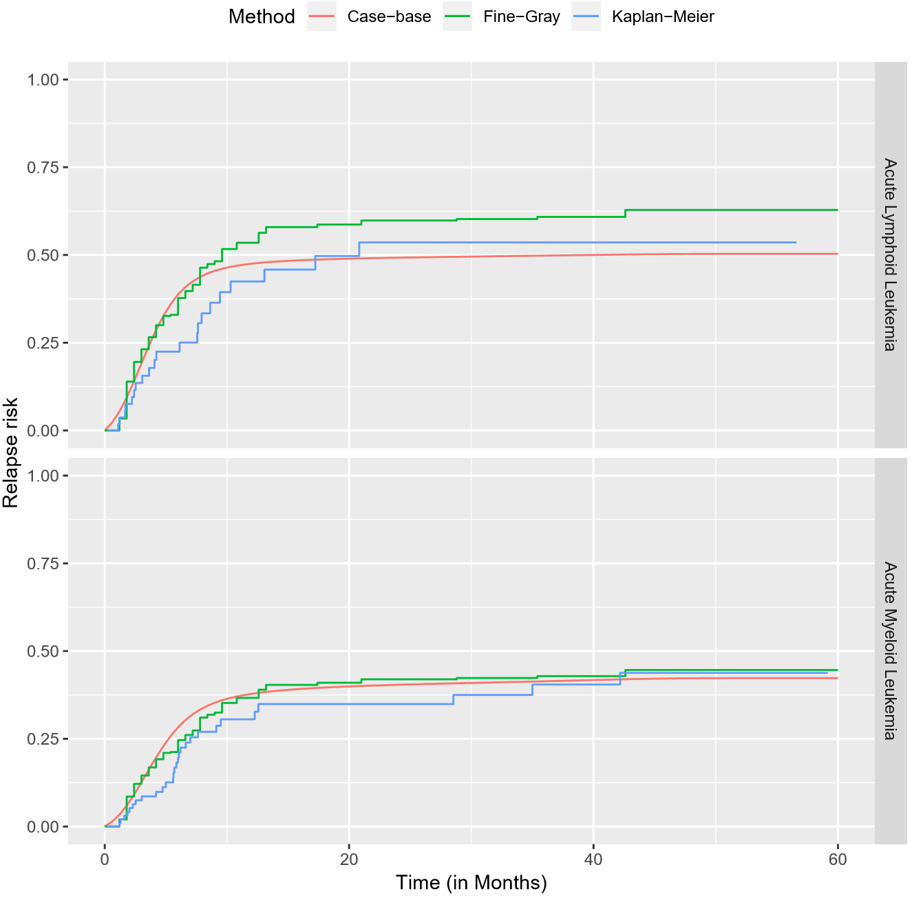
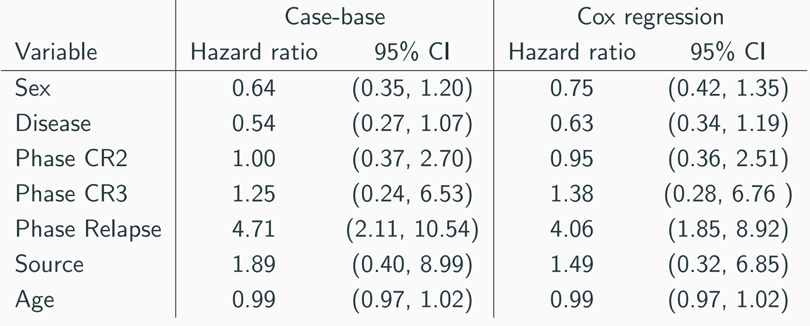

```{r packages,echo=FALSE}
knitr::read_chunk("010-packages.R")

```

```{r required-packages, echo=FALSE, warning=FALSE,message=FALSE,results='hide'}
#cleanbib()
options("citation_format" = "pandoc")
bib <- read.bibtex("010-bibliography.bib")
```
--- 

#Motivating Example

## Motivating Example {.emphasized}
* Meet Carol
    * Age: 56
    * Worried about his Prostate
    * What is Carol's two year risk for death by Prostate Cancer?

## Popular methods in time-to-event analysis 

* In disease etiology, we tend to make use of the proportional hazards hypothesis 
    * Cox Regression

* When we want the absolute risk:
    * Parametric models
    * Breslow estimator

# Motivations for a new method
## Motivations for a new method
* Julien and Hanley (2008) found that survival analysis rarely produces prognostic functions, even though the software is widely available in cox regression packages.
* They believe that this is due to the Cumulative incidence curves (or survival curves) being stepwise rather than smooth, reducing interpretability.
* Parametric model packages don’t usually allow modification of the time component.
* A streamlined approach for reaching a **smooth absolute risk** curve

#Data on the men in the European Randomized Study of Prostate Cancer Screening (ERSPC)

## ERSPC Data

* ~150 000 men ages 55-69
* First start: 1991
* End: 2006 
*

## ERSPC Data

```{r , echo=FALSE, warning=FALSE,message=FALSE}
ERSPCtable <- flextable( head(ERSPC, n = 7 ), col_keys=c("ScrArm","Follow.Up.Time","DeadOfPrCa"))

ERSPCtable <- bold(ERSPCtable, part = "header")
ERSPCtable <- fontsize(ERSPCtable, size=25)
ERSPCtable <- fontsize(ERSPCtable, part = "header",size=32)
ERSPCtable <- padding( ERSPCtable, padding = 10, part = "all" )
ERSPCtable
ERSPC$ScrArm <- factor(ERSPC$ScrArm, 
                       levels = c(0,1), 
                       labels = c("Control group", "Screening group"))
```


#Casebase: Population-Time plots

##Casebase: Population-Time plots
```{r , echo=FALSE, warning=FALSE,message=FALSE}
ERSPC=ERSPC
nobs <- nrow(ERSPC)
ftime <- ERSPC$Follow.Up.Time
ord <- order(ftime, decreasing = FALSE)
yCoords <- cbind(cumsum(ERSPC[ord, "DeadOfPrCa"] == 1),
                 cumsum(ERSPC[ord, "DeadOfPrCa"] == 0))
yCoords <- cbind(yCoords, nobs - rowSums(yCoords))
aspectRatio <- 0.75
height <- 8.5 * aspectRatio; width <- 11 * aspectRatio
cases <- ERSPC[, "DeadOfPrCa"] == 1
comps <- ERSPC[, "DeadOfPrCa"] == 2

# randomly move the cases vertically
moved_cases <- yCoords[cases[ord], 3] * runif(sum(cases))
moved_comps <- yCoords[comps[ord], 3] * runif(sum(comps))

plot(0, type = 'n', xlim = c(0, max(ftime)), ylim = c(0, nobs), legend=TRUE,
     xlab = 'Follow-up time (months)', ylab = 'Population')
polygon(c(0, 0, ftime[ord], max(ftime), 0),
        c(0, nobs, yCoords[,3], 0, 0),
        col = "grey90")
points((ftime[ord])[cases[ord]], yCoords[cases[ord],3], pch = 19,
       col = "firebrick3", cex = 0.5)
legend("right", legend = c("Event"),
       col = c("firebrick3", "dodgerblue2", "black"),
       pch = 19)

```

##Casebase: Population-Time plots
```{r, results='hide',warning=FALSE}
pt_object <- casebase::popTime(ERSPC, event = "DeadOfPrCa",time="Follow.Up.Time")
plot(pt_object,legend=TRUE,legend.position = "right")
```

#Casebase: Theory

##Casebase: Sampling

* Case-series: all observations where an event occurs
* Base-series: a sample of the population time plot.


##Casebase: Sampling

* c = case-series
* b = base-series
* Should we use a ratio of b=100c, the coefficients are expected to be only 1% larger, using case-base sampling.
* Casebase sampling simplifies the model fitting so that multinomal regression can be used.

$$(\frac{1}{c}+\frac{1}{b})^{-1}$$

##Casebase: GLMs

<div class="centered">
 * $Let: \ odds=e^{\beta X}$
 * $h(x,t)*B/b=odds$ 
 * $h(x,t)*B/b=e^{\beta X}$
 * $log(h(\hat{x,t}))=log(b/B)+\beta X$
</div>


##Casebase: Likelihood

* For each event type $j=1,...,m$, there exists a non-homogeneous poisson process with a hazard $h_{j}(t)$
* For any given point in time, only one event can occur.
* Censoring is non informative
* Casebase sampling also follows a nonhomogeneous Poisson process, where hazard = $\rho(t)$

$$ \prod^{m}_{j=1}\frac{h_{j}(t)^{dN_{j}(t)}}{\rho(t)+\sum^{m}_{j=1}h_{j}(t)}$$

##Casebase: Likelihood


* Likelihood is reminiscent to log odds
    * Offset of $log(\rho(t))$ where does this come from??
* Likelihood results in a mean of 0 and is asymptotically normal.
* Gives access to GLM software and statistical tools. (deviance tests, information criteria, regualrization, etc.)


$$ \prod^{m}_{j=1}\frac{\lambda_{j}(t)^{dN_{j}(t)}}{\rho(t)+\sum^{m}_{j=1}\lambda_{j}(t)}$$

##Casebase: Parametric families
* We can now fit models of the form:
        $\ log(h(t;\alpha,\beta))=g(t;\alpha)+\beta X$
* By changing the function $g(t;\alpha)$, we can model different parametric families easily:

    * Exponential: $g(t;\alpha)$ is equal to a constant
    * Gompertz: $g(t;\alpha)=\alpha t$
    * Weibull: $g(t;\alpha) = \alpha log(t)$

#Full Example

##Data on transplant patients (bmtcrr)

```{r , echo=FALSE, warning=FALSE,message=FALSE}
data(bmtcrr)
bmtcrrtable <- flextable( head(bmtcrr, n = 7 ), col_keys=c("Sex","D","Phase","Age","Status","source","ftime"))

bmtcrrtable <- bold(bmtcrrtable, part = "header")
bmtcrrtable <- fontsize(bmtcrrtable, size=25)
bmtcrrtable <- fontsize(bmtcrrtable, part = "header",size=32)
bmtcrrtable <- padding( bmtcrrtable, padding = 10, part = "all" )
bmtcrrtable
```

##Population-Time plot (bmtcrr)
```{r,echo=FALSE, results='hide',warning=FALSE}
nobs <- nrow(bmtcrr)
ftime <- bmtcrr$ftime
ord <- order(ftime, decreasing = FALSE)
yCoords <- cbind(cumsum(bmtcrr[ord, "Status"] == 2),
                 cumsum(bmtcrr[ord, "Status"] == 1),
                 cumsum(bmtcrr[ord, "Status"] == 0))
yCoords <- cbind(yCoords, nobs - rowSums(yCoords))
aspectRatio <- 0.75
height <- 8.5 * aspectRatio; width <- 11 * aspectRatio
cases <- bmtcrr[, "Status"] == 1
comps <- bmtcrr[, "Status"] == 2
moved_cases <- yCoords[cases[ord], 4] * runif(sum(cases))
moved_comps <- yCoords[comps[ord], 4] * runif(sum(comps))
plot(0, type = 'n', xlim = c(0, max(ftime)), ylim = c(0, nobs),
     xlab = 'Follow-up time (months)', ylab = 'Population')
polygon(c(0, 0, ftime[ord], max(ftime), 0),
        c(0, nobs, yCoords[,4], 0, 0),
        col = "grey90")
points((ftime[ord])[cases[ord]], moved_cases, pch = 19,
       col = "firebrick3", cex = 0.5)
points((ftime[ord])[comps[ord]], moved_comps, pch = 19,
       col = "dodgerblue2", cex = 0.5)
legend("topright", legend = c("Relapse", "Competing event"),
       col = c("firebrick3", "dodgerblue2", "black"),
       pch = 19)

```

##Stratified Population-time plot
```{r , echo=FALSE, results='hide',warning=FALSE}
stratpopTime <- casebase::popTime(data = bmtcrr, time = "ftime", exposure = "D")
plot(stratpopTime,legend=TRUE,legend.position = "right")
```

#Comparing Kaplan-Meier, Fine-Gray and Casebase

##Comparing Kaplan-Meier, Fine-Gray and Casebase

<div style="width:8.25; height:6.375">

</div>

## Table of coefficients between Casebase and Cox

<div style="width:8.25; height:6.375">

</div>

```{r , echo=FALSE, results='hide',warning=FALSE}
bibliography()
```
