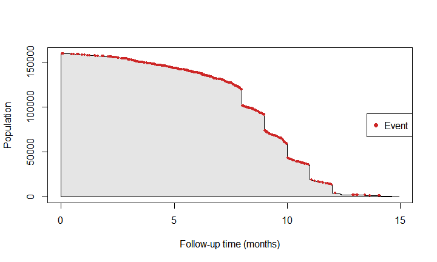
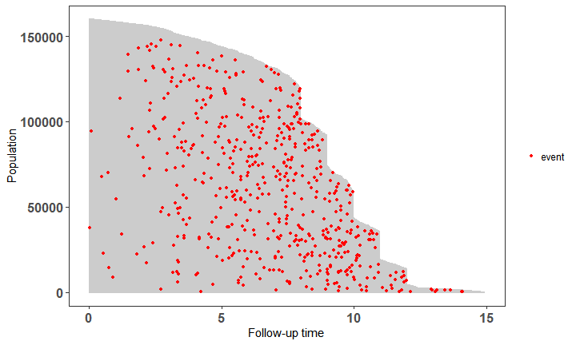
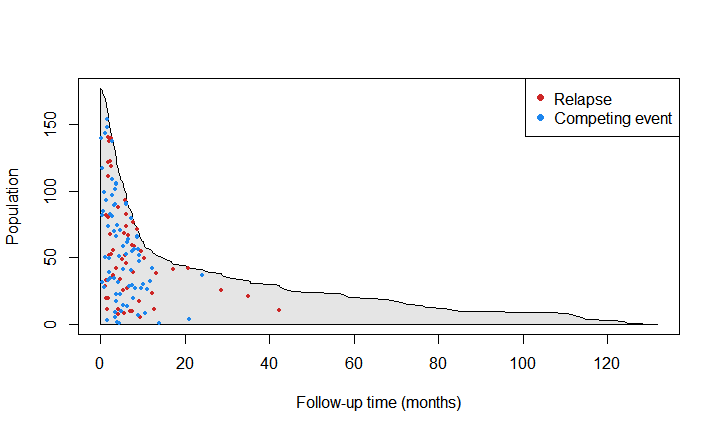
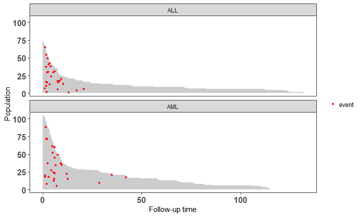
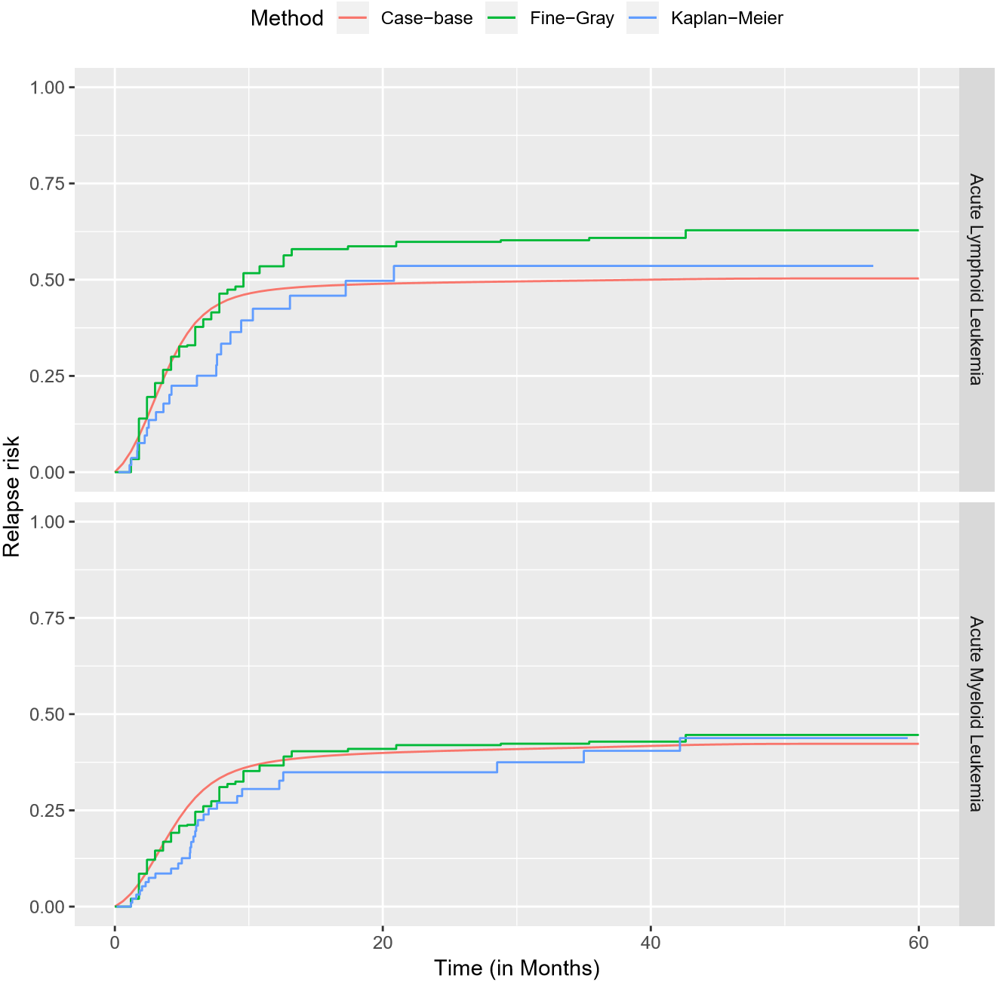
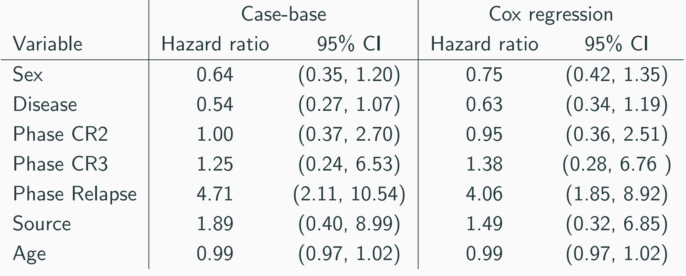

--- 

#Motivating Example

## Motivating Example {.emphasized}
* Meet Carol
    * Age: 56
    * Worried about his Prostate
    * What is Carol's two year risk for death by Prostate Cancer?

## Popular methods in time-to-event analysis 

* In disease etiology, we tend to make use of the proportional hazards hypothesis 
    * Cox Regression

* When we want the absolute risk:
    * Parametric models
    * Breslow estimator

# Motivations for a new method
## Motivations for a new method
* Julien and Hanley (2008) found that survival analysis rarely produces prognostic functions, even though the software is widely available in cox regression packages.
* They believe that this is due to the Cumulative incidence curves (or survival curves) being stepwise rather than smooth, reducing interpretability.
* Parametric model packages don’t usually allow modification of the time component.
* A streamlined approach for reaching a **smooth absolute risk** curve

## Dr. Hernan's perspective

##Dr. Cox's perspective

#Data on the men in the European Randomized Study of Prostate Cancer Screening (ERSPC)

## ERSPC Data

* ~150 000 men ages 55-69
* First start: 1991
* End: 2006 
*

## ERSPC Data

<!--html_preserve--><div class="tabwid"><table style='border-collapse:collapse;'><thead><tr><td style="width:54px;height:18px;background-color:transparent;vertical-align: middle;transform: rotate(0deg);border-bottom: 2px solid rgba(0, 0, 0, 1.00);border-top: 2px solid rgba(0, 0, 0, 1.00);border-left: 0 solid rgba(0, 0, 0, 1.00);border-right: 0 solid rgba(0, 0, 0, 1.00);margin-bottom:0;margin-top:0;margin-left:0;margin-right:0;"><p style="margin:0;text-align:right;border-bottom: 0 solid rgba(0, 0, 0, 1.00);border-top: 0 solid rgba(0, 0, 0, 1.00);border-left: 0 solid rgba(0, 0, 0, 1.00);border-right: 0 solid rgba(0, 0, 0, 1.00);padding-bottom:10px;padding-top:10px;padding-left:10px;padding-right:10px;background-color:transparent;"><span style="font-family:'Arial';font-size:32px;font-weight:bold;font-style:normal;text-decoration:none;color:rgba(17, 17, 17, 1.00);background-color:transparent;">ScrArm</span></p></td><td style="width:54px;height:18px;background-color:transparent;vertical-align: middle;transform: rotate(0deg);border-bottom: 2px solid rgba(0, 0, 0, 1.00);border-top: 2px solid rgba(0, 0, 0, 1.00);border-left: 0 solid rgba(0, 0, 0, 1.00);border-right: 0 solid rgba(0, 0, 0, 1.00);margin-bottom:0;margin-top:0;margin-left:0;margin-right:0;"><p style="margin:0;text-align:right;border-bottom: 0 solid rgba(0, 0, 0, 1.00);border-top: 0 solid rgba(0, 0, 0, 1.00);border-left: 0 solid rgba(0, 0, 0, 1.00);border-right: 0 solid rgba(0, 0, 0, 1.00);padding-bottom:10px;padding-top:10px;padding-left:10px;padding-right:10px;background-color:transparent;"><span style="font-family:'Arial';font-size:32px;font-weight:bold;font-style:normal;text-decoration:none;color:rgba(17, 17, 17, 1.00);background-color:transparent;">Follow.Up.Time</span></p></td><td style="width:54px;height:18px;background-color:transparent;vertical-align: middle;transform: rotate(0deg);border-bottom: 2px solid rgba(0, 0, 0, 1.00);border-top: 2px solid rgba(0, 0, 0, 1.00);border-left: 0 solid rgba(0, 0, 0, 1.00);border-right: 0 solid rgba(0, 0, 0, 1.00);margin-bottom:0;margin-top:0;margin-left:0;margin-right:0;"><p style="margin:0;text-align:right;border-bottom: 0 solid rgba(0, 0, 0, 1.00);border-top: 0 solid rgba(0, 0, 0, 1.00);border-left: 0 solid rgba(0, 0, 0, 1.00);border-right: 0 solid rgba(0, 0, 0, 1.00);padding-bottom:10px;padding-top:10px;padding-left:10px;padding-right:10px;background-color:transparent;"><span style="font-family:'Arial';font-size:32px;font-weight:bold;font-style:normal;text-decoration:none;color:rgba(17, 17, 17, 1.00);background-color:transparent;">DeadOfPrCa</span></p></td></tr></thead><tbody><tr><td style="width:54px;height:18px;background-color:transparent;vertical-align: middle;transform: rotate(0deg);border-bottom: 0 solid rgba(0, 0, 0, 1.00);border-top: 0 solid rgba(0, 0, 0, 1.00);border-left: 0 solid rgba(0, 0, 0, 1.00);border-right: 0 solid rgba(0, 0, 0, 1.00);margin-bottom:0;margin-top:0;margin-left:0;margin-right:0;"><p style="margin:0;text-align:right;border-bottom: 0 solid rgba(0, 0, 0, 1.00);border-top: 0 solid rgba(0, 0, 0, 1.00);border-left: 0 solid rgba(0, 0, 0, 1.00);border-right: 0 solid rgba(0, 0, 0, 1.00);padding-bottom:10px;padding-top:10px;padding-left:10px;padding-right:10px;background-color:transparent;"><span style="font-family:'Arial';font-size:25px;font-weight:normal;font-style:normal;text-decoration:none;color:rgba(17, 17, 17, 1.00);background-color:transparent;">1</span></p></td><td style="width:54px;height:18px;background-color:transparent;vertical-align: middle;transform: rotate(0deg);border-bottom: 0 solid rgba(0, 0, 0, 1.00);border-top: 0 solid rgba(0, 0, 0, 1.00);border-left: 0 solid rgba(0, 0, 0, 1.00);border-right: 0 solid rgba(0, 0, 0, 1.00);margin-bottom:0;margin-top:0;margin-left:0;margin-right:0;"><p style="margin:0;text-align:right;border-bottom: 0 solid rgba(0, 0, 0, 1.00);border-top: 0 solid rgba(0, 0, 0, 1.00);border-left: 0 solid rgba(0, 0, 0, 1.00);border-right: 0 solid rgba(0, 0, 0, 1.00);padding-bottom:10px;padding-top:10px;padding-left:10px;padding-right:10px;background-color:transparent;"><span style="font-family:'Arial';font-size:25px;font-weight:normal;font-style:normal;text-decoration:none;color:rgba(17, 17, 17, 1.00);background-color:transparent;">0.003</span></p></td><td style="width:54px;height:18px;background-color:transparent;vertical-align: middle;transform: rotate(0deg);border-bottom: 0 solid rgba(0, 0, 0, 1.00);border-top: 0 solid rgba(0, 0, 0, 1.00);border-left: 0 solid rgba(0, 0, 0, 1.00);border-right: 0 solid rgba(0, 0, 0, 1.00);margin-bottom:0;margin-top:0;margin-left:0;margin-right:0;"><p style="margin:0;text-align:right;border-bottom: 0 solid rgba(0, 0, 0, 1.00);border-top: 0 solid rgba(0, 0, 0, 1.00);border-left: 0 solid rgba(0, 0, 0, 1.00);border-right: 0 solid rgba(0, 0, 0, 1.00);padding-bottom:10px;padding-top:10px;padding-left:10px;padding-right:10px;background-color:transparent;"><span style="font-family:'Arial';font-size:25px;font-weight:normal;font-style:normal;text-decoration:none;color:rgba(17, 17, 17, 1.00);background-color:transparent;">0</span></p></td></tr><tr><td style="width:54px;height:18px;background-color:transparent;vertical-align: middle;transform: rotate(0deg);border-bottom: 0 solid rgba(0, 0, 0, 1.00);border-top: 0 solid rgba(0, 0, 0, 1.00);border-left: 0 solid rgba(0, 0, 0, 1.00);border-right: 0 solid rgba(0, 0, 0, 1.00);margin-bottom:0;margin-top:0;margin-left:0;margin-right:0;"><p style="margin:0;text-align:right;border-bottom: 0 solid rgba(0, 0, 0, 1.00);border-top: 0 solid rgba(0, 0, 0, 1.00);border-left: 0 solid rgba(0, 0, 0, 1.00);border-right: 0 solid rgba(0, 0, 0, 1.00);padding-bottom:10px;padding-top:10px;padding-left:10px;padding-right:10px;background-color:transparent;"><span style="font-family:'Arial';font-size:25px;font-weight:normal;font-style:normal;text-decoration:none;color:rgba(17, 17, 17, 1.00);background-color:transparent;">1</span></p></td><td style="width:54px;height:18px;background-color:transparent;vertical-align: middle;transform: rotate(0deg);border-bottom: 0 solid rgba(0, 0, 0, 1.00);border-top: 0 solid rgba(0, 0, 0, 1.00);border-left: 0 solid rgba(0, 0, 0, 1.00);border-right: 0 solid rgba(0, 0, 0, 1.00);margin-bottom:0;margin-top:0;margin-left:0;margin-right:0;"><p style="margin:0;text-align:right;border-bottom: 0 solid rgba(0, 0, 0, 1.00);border-top: 0 solid rgba(0, 0, 0, 1.00);border-left: 0 solid rgba(0, 0, 0, 1.00);border-right: 0 solid rgba(0, 0, 0, 1.00);padding-bottom:10px;padding-top:10px;padding-left:10px;padding-right:10px;background-color:transparent;"><span style="font-family:'Arial';font-size:25px;font-weight:normal;font-style:normal;text-decoration:none;color:rgba(17, 17, 17, 1.00);background-color:transparent;">0.003</span></p></td><td style="width:54px;height:18px;background-color:transparent;vertical-align: middle;transform: rotate(0deg);border-bottom: 0 solid rgba(0, 0, 0, 1.00);border-top: 0 solid rgba(0, 0, 0, 1.00);border-left: 0 solid rgba(0, 0, 0, 1.00);border-right: 0 solid rgba(0, 0, 0, 1.00);margin-bottom:0;margin-top:0;margin-left:0;margin-right:0;"><p style="margin:0;text-align:right;border-bottom: 0 solid rgba(0, 0, 0, 1.00);border-top: 0 solid rgba(0, 0, 0, 1.00);border-left: 0 solid rgba(0, 0, 0, 1.00);border-right: 0 solid rgba(0, 0, 0, 1.00);padding-bottom:10px;padding-top:10px;padding-left:10px;padding-right:10px;background-color:transparent;"><span style="font-family:'Arial';font-size:25px;font-weight:normal;font-style:normal;text-decoration:none;color:rgba(17, 17, 17, 1.00);background-color:transparent;">0</span></p></td></tr><tr><td style="width:54px;height:18px;background-color:transparent;vertical-align: middle;transform: rotate(0deg);border-bottom: 0 solid rgba(0, 0, 0, 1.00);border-top: 0 solid rgba(0, 0, 0, 1.00);border-left: 0 solid rgba(0, 0, 0, 1.00);border-right: 0 solid rgba(0, 0, 0, 1.00);margin-bottom:0;margin-top:0;margin-left:0;margin-right:0;"><p style="margin:0;text-align:right;border-bottom: 0 solid rgba(0, 0, 0, 1.00);border-top: 0 solid rgba(0, 0, 0, 1.00);border-left: 0 solid rgba(0, 0, 0, 1.00);border-right: 0 solid rgba(0, 0, 0, 1.00);padding-bottom:10px;padding-top:10px;padding-left:10px;padding-right:10px;background-color:transparent;"><span style="font-family:'Arial';font-size:25px;font-weight:normal;font-style:normal;text-decoration:none;color:rgba(17, 17, 17, 1.00);background-color:transparent;">1</span></p></td><td style="width:54px;height:18px;background-color:transparent;vertical-align: middle;transform: rotate(0deg);border-bottom: 0 solid rgba(0, 0, 0, 1.00);border-top: 0 solid rgba(0, 0, 0, 1.00);border-left: 0 solid rgba(0, 0, 0, 1.00);border-right: 0 solid rgba(0, 0, 0, 1.00);margin-bottom:0;margin-top:0;margin-left:0;margin-right:0;"><p style="margin:0;text-align:right;border-bottom: 0 solid rgba(0, 0, 0, 1.00);border-top: 0 solid rgba(0, 0, 0, 1.00);border-left: 0 solid rgba(0, 0, 0, 1.00);border-right: 0 solid rgba(0, 0, 0, 1.00);padding-bottom:10px;padding-top:10px;padding-left:10px;padding-right:10px;background-color:transparent;"><span style="font-family:'Arial';font-size:25px;font-weight:normal;font-style:normal;text-decoration:none;color:rgba(17, 17, 17, 1.00);background-color:transparent;">0.003</span></p></td><td style="width:54px;height:18px;background-color:transparent;vertical-align: middle;transform: rotate(0deg);border-bottom: 0 solid rgba(0, 0, 0, 1.00);border-top: 0 solid rgba(0, 0, 0, 1.00);border-left: 0 solid rgba(0, 0, 0, 1.00);border-right: 0 solid rgba(0, 0, 0, 1.00);margin-bottom:0;margin-top:0;margin-left:0;margin-right:0;"><p style="margin:0;text-align:right;border-bottom: 0 solid rgba(0, 0, 0, 1.00);border-top: 0 solid rgba(0, 0, 0, 1.00);border-left: 0 solid rgba(0, 0, 0, 1.00);border-right: 0 solid rgba(0, 0, 0, 1.00);padding-bottom:10px;padding-top:10px;padding-left:10px;padding-right:10px;background-color:transparent;"><span style="font-family:'Arial';font-size:25px;font-weight:normal;font-style:normal;text-decoration:none;color:rgba(17, 17, 17, 1.00);background-color:transparent;">0</span></p></td></tr><tr><td style="width:54px;height:18px;background-color:transparent;vertical-align: middle;transform: rotate(0deg);border-bottom: 0 solid rgba(0, 0, 0, 1.00);border-top: 0 solid rgba(0, 0, 0, 1.00);border-left: 0 solid rgba(0, 0, 0, 1.00);border-right: 0 solid rgba(0, 0, 0, 1.00);margin-bottom:0;margin-top:0;margin-left:0;margin-right:0;"><p style="margin:0;text-align:right;border-bottom: 0 solid rgba(0, 0, 0, 1.00);border-top: 0 solid rgba(0, 0, 0, 1.00);border-left: 0 solid rgba(0, 0, 0, 1.00);border-right: 0 solid rgba(0, 0, 0, 1.00);padding-bottom:10px;padding-top:10px;padding-left:10px;padding-right:10px;background-color:transparent;"><span style="font-family:'Arial';font-size:25px;font-weight:normal;font-style:normal;text-decoration:none;color:rgba(17, 17, 17, 1.00);background-color:transparent;">0</span></p></td><td style="width:54px;height:18px;background-color:transparent;vertical-align: middle;transform: rotate(0deg);border-bottom: 0 solid rgba(0, 0, 0, 1.00);border-top: 0 solid rgba(0, 0, 0, 1.00);border-left: 0 solid rgba(0, 0, 0, 1.00);border-right: 0 solid rgba(0, 0, 0, 1.00);margin-bottom:0;margin-top:0;margin-left:0;margin-right:0;"><p style="margin:0;text-align:right;border-bottom: 0 solid rgba(0, 0, 0, 1.00);border-top: 0 solid rgba(0, 0, 0, 1.00);border-left: 0 solid rgba(0, 0, 0, 1.00);border-right: 0 solid rgba(0, 0, 0, 1.00);padding-bottom:10px;padding-top:10px;padding-left:10px;padding-right:10px;background-color:transparent;"><span style="font-family:'Arial';font-size:25px;font-weight:normal;font-style:normal;text-decoration:none;color:rgba(17, 17, 17, 1.00);background-color:transparent;">0.003</span></p></td><td style="width:54px;height:18px;background-color:transparent;vertical-align: middle;transform: rotate(0deg);border-bottom: 0 solid rgba(0, 0, 0, 1.00);border-top: 0 solid rgba(0, 0, 0, 1.00);border-left: 0 solid rgba(0, 0, 0, 1.00);border-right: 0 solid rgba(0, 0, 0, 1.00);margin-bottom:0;margin-top:0;margin-left:0;margin-right:0;"><p style="margin:0;text-align:right;border-bottom: 0 solid rgba(0, 0, 0, 1.00);border-top: 0 solid rgba(0, 0, 0, 1.00);border-left: 0 solid rgba(0, 0, 0, 1.00);border-right: 0 solid rgba(0, 0, 0, 1.00);padding-bottom:10px;padding-top:10px;padding-left:10px;padding-right:10px;background-color:transparent;"><span style="font-family:'Arial';font-size:25px;font-weight:normal;font-style:normal;text-decoration:none;color:rgba(17, 17, 17, 1.00);background-color:transparent;">0</span></p></td></tr><tr><td style="width:54px;height:18px;background-color:transparent;vertical-align: middle;transform: rotate(0deg);border-bottom: 0 solid rgba(0, 0, 0, 1.00);border-top: 0 solid rgba(0, 0, 0, 1.00);border-left: 0 solid rgba(0, 0, 0, 1.00);border-right: 0 solid rgba(0, 0, 0, 1.00);margin-bottom:0;margin-top:0;margin-left:0;margin-right:0;"><p style="margin:0;text-align:right;border-bottom: 0 solid rgba(0, 0, 0, 1.00);border-top: 0 solid rgba(0, 0, 0, 1.00);border-left: 0 solid rgba(0, 0, 0, 1.00);border-right: 0 solid rgba(0, 0, 0, 1.00);padding-bottom:10px;padding-top:10px;padding-left:10px;padding-right:10px;background-color:transparent;"><span style="font-family:'Arial';font-size:25px;font-weight:normal;font-style:normal;text-decoration:none;color:rgba(17, 17, 17, 1.00);background-color:transparent;">0</span></p></td><td style="width:54px;height:18px;background-color:transparent;vertical-align: middle;transform: rotate(0deg);border-bottom: 0 solid rgba(0, 0, 0, 1.00);border-top: 0 solid rgba(0, 0, 0, 1.00);border-left: 0 solid rgba(0, 0, 0, 1.00);border-right: 0 solid rgba(0, 0, 0, 1.00);margin-bottom:0;margin-top:0;margin-left:0;margin-right:0;"><p style="margin:0;text-align:right;border-bottom: 0 solid rgba(0, 0, 0, 1.00);border-top: 0 solid rgba(0, 0, 0, 1.00);border-left: 0 solid rgba(0, 0, 0, 1.00);border-right: 0 solid rgba(0, 0, 0, 1.00);padding-bottom:10px;padding-top:10px;padding-left:10px;padding-right:10px;background-color:transparent;"><span style="font-family:'Arial';font-size:25px;font-weight:normal;font-style:normal;text-decoration:none;color:rgba(17, 17, 17, 1.00);background-color:transparent;">0.003</span></p></td><td style="width:54px;height:18px;background-color:transparent;vertical-align: middle;transform: rotate(0deg);border-bottom: 0 solid rgba(0, 0, 0, 1.00);border-top: 0 solid rgba(0, 0, 0, 1.00);border-left: 0 solid rgba(0, 0, 0, 1.00);border-right: 0 solid rgba(0, 0, 0, 1.00);margin-bottom:0;margin-top:0;margin-left:0;margin-right:0;"><p style="margin:0;text-align:right;border-bottom: 0 solid rgba(0, 0, 0, 1.00);border-top: 0 solid rgba(0, 0, 0, 1.00);border-left: 0 solid rgba(0, 0, 0, 1.00);border-right: 0 solid rgba(0, 0, 0, 1.00);padding-bottom:10px;padding-top:10px;padding-left:10px;padding-right:10px;background-color:transparent;"><span style="font-family:'Arial';font-size:25px;font-weight:normal;font-style:normal;text-decoration:none;color:rgba(17, 17, 17, 1.00);background-color:transparent;">0</span></p></td></tr><tr><td style="width:54px;height:18px;background-color:transparent;vertical-align: middle;transform: rotate(0deg);border-bottom: 0 solid rgba(0, 0, 0, 1.00);border-top: 0 solid rgba(0, 0, 0, 1.00);border-left: 0 solid rgba(0, 0, 0, 1.00);border-right: 0 solid rgba(0, 0, 0, 1.00);margin-bottom:0;margin-top:0;margin-left:0;margin-right:0;"><p style="margin:0;text-align:right;border-bottom: 0 solid rgba(0, 0, 0, 1.00);border-top: 0 solid rgba(0, 0, 0, 1.00);border-left: 0 solid rgba(0, 0, 0, 1.00);border-right: 0 solid rgba(0, 0, 0, 1.00);padding-bottom:10px;padding-top:10px;padding-left:10px;padding-right:10px;background-color:transparent;"><span style="font-family:'Arial';font-size:25px;font-weight:normal;font-style:normal;text-decoration:none;color:rgba(17, 17, 17, 1.00);background-color:transparent;">0</span></p></td><td style="width:54px;height:18px;background-color:transparent;vertical-align: middle;transform: rotate(0deg);border-bottom: 0 solid rgba(0, 0, 0, 1.00);border-top: 0 solid rgba(0, 0, 0, 1.00);border-left: 0 solid rgba(0, 0, 0, 1.00);border-right: 0 solid rgba(0, 0, 0, 1.00);margin-bottom:0;margin-top:0;margin-left:0;margin-right:0;"><p style="margin:0;text-align:right;border-bottom: 0 solid rgba(0, 0, 0, 1.00);border-top: 0 solid rgba(0, 0, 0, 1.00);border-left: 0 solid rgba(0, 0, 0, 1.00);border-right: 0 solid rgba(0, 0, 0, 1.00);padding-bottom:10px;padding-top:10px;padding-left:10px;padding-right:10px;background-color:transparent;"><span style="font-family:'Arial';font-size:25px;font-weight:normal;font-style:normal;text-decoration:none;color:rgba(17, 17, 17, 1.00);background-color:transparent;">0.003</span></p></td><td style="width:54px;height:18px;background-color:transparent;vertical-align: middle;transform: rotate(0deg);border-bottom: 0 solid rgba(0, 0, 0, 1.00);border-top: 0 solid rgba(0, 0, 0, 1.00);border-left: 0 solid rgba(0, 0, 0, 1.00);border-right: 0 solid rgba(0, 0, 0, 1.00);margin-bottom:0;margin-top:0;margin-left:0;margin-right:0;"><p style="margin:0;text-align:right;border-bottom: 0 solid rgba(0, 0, 0, 1.00);border-top: 0 solid rgba(0, 0, 0, 1.00);border-left: 0 solid rgba(0, 0, 0, 1.00);border-right: 0 solid rgba(0, 0, 0, 1.00);padding-bottom:10px;padding-top:10px;padding-left:10px;padding-right:10px;background-color:transparent;"><span style="font-family:'Arial';font-size:25px;font-weight:normal;font-style:normal;text-decoration:none;color:rgba(17, 17, 17, 1.00);background-color:transparent;">0</span></p></td></tr><tr><td style="width:54px;height:18px;background-color:transparent;vertical-align: middle;transform: rotate(0deg);border-bottom: 2px solid rgba(0, 0, 0, 1.00);border-top: 0 solid rgba(0, 0, 0, 1.00);border-left: 0 solid rgba(0, 0, 0, 1.00);border-right: 0 solid rgba(0, 0, 0, 1.00);margin-bottom:0;margin-top:0;margin-left:0;margin-right:0;"><p style="margin:0;text-align:right;border-bottom: 0 solid rgba(0, 0, 0, 1.00);border-top: 0 solid rgba(0, 0, 0, 1.00);border-left: 0 solid rgba(0, 0, 0, 1.00);border-right: 0 solid rgba(0, 0, 0, 1.00);padding-bottom:10px;padding-top:10px;padding-left:10px;padding-right:10px;background-color:transparent;"><span style="font-family:'Arial';font-size:25px;font-weight:normal;font-style:normal;text-decoration:none;color:rgba(17, 17, 17, 1.00);background-color:transparent;">0</span></p></td><td style="width:54px;height:18px;background-color:transparent;vertical-align: middle;transform: rotate(0deg);border-bottom: 2px solid rgba(0, 0, 0, 1.00);border-top: 0 solid rgba(0, 0, 0, 1.00);border-left: 0 solid rgba(0, 0, 0, 1.00);border-right: 0 solid rgba(0, 0, 0, 1.00);margin-bottom:0;margin-top:0;margin-left:0;margin-right:0;"><p style="margin:0;text-align:right;border-bottom: 0 solid rgba(0, 0, 0, 1.00);border-top: 0 solid rgba(0, 0, 0, 1.00);border-left: 0 solid rgba(0, 0, 0, 1.00);border-right: 0 solid rgba(0, 0, 0, 1.00);padding-bottom:10px;padding-top:10px;padding-left:10px;padding-right:10px;background-color:transparent;"><span style="font-family:'Arial';font-size:25px;font-weight:normal;font-style:normal;text-decoration:none;color:rgba(17, 17, 17, 1.00);background-color:transparent;">0.003</span></p></td><td style="width:54px;height:18px;background-color:transparent;vertical-align: middle;transform: rotate(0deg);border-bottom: 2px solid rgba(0, 0, 0, 1.00);border-top: 0 solid rgba(0, 0, 0, 1.00);border-left: 0 solid rgba(0, 0, 0, 1.00);border-right: 0 solid rgba(0, 0, 0, 1.00);margin-bottom:0;margin-top:0;margin-left:0;margin-right:0;"><p style="margin:0;text-align:right;border-bottom: 0 solid rgba(0, 0, 0, 1.00);border-top: 0 solid rgba(0, 0, 0, 1.00);border-left: 0 solid rgba(0, 0, 0, 1.00);border-right: 0 solid rgba(0, 0, 0, 1.00);padding-bottom:10px;padding-top:10px;padding-left:10px;padding-right:10px;background-color:transparent;"><span style="font-family:'Arial';font-size:25px;font-weight:normal;font-style:normal;text-decoration:none;color:rgba(17, 17, 17, 1.00);background-color:transparent;">0</span></p></td></tr></tbody></table></div><!--/html_preserve-->


#Casebase: Population-Time plots

##Casebase: Population-Time plots
<!-- -->

##Casebase: Population-Time plots

```r
pt_object <- casebase::popTime(ERSPC, event = "DeadOfPrCa",time="Follow.Up.Time")
plot(pt_object,legend=TRUE,legend.position = "right")
```

<!-- -->

#Casebase: Theory

##Casebase: Sampling

* Case-series: all observations where an event occurs
* Base-series: a sample of the population time plot.


##Casebase: Sampling

* c = case-series
* b = base-series
* Should we use a ratio of b=100c, the coefficients are expected to be only 1% larger, using case-base sampling.
* Casebase sampling simplifies the model fitting so that multinomal regression can be used.

$$(\frac{1}{c}+\frac{1}{b})^{-1}$$

##Casebase: GLMs

<div class="centered">
 * $Let: \ odds=e^{\beta X}$
 * $h(x,t)*B/b=odds$ 
 * $h(x,t)*B/b=e^{\beta X}$
 * $log(h(\hat{x,t}))=log(b/B)+\beta X$
</div>


##Casebase: Likelihood

* For each event type $j=1,...,m$, there exists a non-homogeneous poisson process with a hazard $h_{j}(t)$
* For any given point in time, only one event can occur.
* Censoring is non informative
* Casebase sampling also follows a nonhomogeneous Poisson process, where hazard = $\rho(t)$

$$ \prod^{m}_{j=1}\frac{h_{j}(t)^{dN_{j}(t)}}{\rho(t)+\sum^{m}_{j=1}h_{j}(t)}$$

##Casebase: Likelihood


* Likelihood is reminiscent to log odds
    * Offset of $log(\rho(t))$ where does this come from??
* Likelihood results in a mean of 0 and is asymptotically normal.
* Gives access to GLM software and statistical tools. (deviance tests, information criteria, regualrization, etc.)


$$ \prod^{m}_{j=1}\frac{\lambda_{j}(t)^{dN_{j}(t)}}{\rho(t)+\sum^{m}_{j=1}\lambda_{j}(t)}$$

##Casebase: Parametric families
* We can now fit models of the form:
        $\ log(h(t;\alpha,\beta))=g(t;\alpha)+\beta X$
* By changing the function $g(t;\alpha)$, we can model different parametric families easily:

    * Exponential: $g(t;\alpha)$ is equal to a constant
    * Gompertz: $g(t;\alpha)=\alpha t$
    * Weibull: $g(t;\alpha) = \alpha log(t)$

#Full Example

##Data on transplant patients (bmtcrr)

<!--html_preserve--><div class="tabwid"><table style='border-collapse:collapse;'><thead><tr><td style="width:54px;height:18px;background-color:transparent;vertical-align: middle;transform: rotate(0deg);border-bottom: 2px solid rgba(0, 0, 0, 1.00);border-top: 2px solid rgba(0, 0, 0, 1.00);border-left: 0 solid rgba(0, 0, 0, 1.00);border-right: 0 solid rgba(0, 0, 0, 1.00);margin-bottom:0;margin-top:0;margin-left:0;margin-right:0;"><p style="margin:0;text-align:left;border-bottom: 0 solid rgba(0, 0, 0, 1.00);border-top: 0 solid rgba(0, 0, 0, 1.00);border-left: 0 solid rgba(0, 0, 0, 1.00);border-right: 0 solid rgba(0, 0, 0, 1.00);padding-bottom:10px;padding-top:10px;padding-left:10px;padding-right:10px;background-color:transparent;"><span style="font-family:'Arial';font-size:32px;font-weight:bold;font-style:normal;text-decoration:none;color:rgba(17, 17, 17, 1.00);background-color:transparent;">Sex</span></p></td><td style="width:54px;height:18px;background-color:transparent;vertical-align: middle;transform: rotate(0deg);border-bottom: 2px solid rgba(0, 0, 0, 1.00);border-top: 2px solid rgba(0, 0, 0, 1.00);border-left: 0 solid rgba(0, 0, 0, 1.00);border-right: 0 solid rgba(0, 0, 0, 1.00);margin-bottom:0;margin-top:0;margin-left:0;margin-right:0;"><p style="margin:0;text-align:left;border-bottom: 0 solid rgba(0, 0, 0, 1.00);border-top: 0 solid rgba(0, 0, 0, 1.00);border-left: 0 solid rgba(0, 0, 0, 1.00);border-right: 0 solid rgba(0, 0, 0, 1.00);padding-bottom:10px;padding-top:10px;padding-left:10px;padding-right:10px;background-color:transparent;"><span style="font-family:'Arial';font-size:32px;font-weight:bold;font-style:normal;text-decoration:none;color:rgba(17, 17, 17, 1.00);background-color:transparent;">D</span></p></td><td style="width:54px;height:18px;background-color:transparent;vertical-align: middle;transform: rotate(0deg);border-bottom: 2px solid rgba(0, 0, 0, 1.00);border-top: 2px solid rgba(0, 0, 0, 1.00);border-left: 0 solid rgba(0, 0, 0, 1.00);border-right: 0 solid rgba(0, 0, 0, 1.00);margin-bottom:0;margin-top:0;margin-left:0;margin-right:0;"><p style="margin:0;text-align:left;border-bottom: 0 solid rgba(0, 0, 0, 1.00);border-top: 0 solid rgba(0, 0, 0, 1.00);border-left: 0 solid rgba(0, 0, 0, 1.00);border-right: 0 solid rgba(0, 0, 0, 1.00);padding-bottom:10px;padding-top:10px;padding-left:10px;padding-right:10px;background-color:transparent;"><span style="font-family:'Arial';font-size:32px;font-weight:bold;font-style:normal;text-decoration:none;color:rgba(17, 17, 17, 1.00);background-color:transparent;">Phase</span></p></td><td style="width:54px;height:18px;background-color:transparent;vertical-align: middle;transform: rotate(0deg);border-bottom: 2px solid rgba(0, 0, 0, 1.00);border-top: 2px solid rgba(0, 0, 0, 1.00);border-left: 0 solid rgba(0, 0, 0, 1.00);border-right: 0 solid rgba(0, 0, 0, 1.00);margin-bottom:0;margin-top:0;margin-left:0;margin-right:0;"><p style="margin:0;text-align:right;border-bottom: 0 solid rgba(0, 0, 0, 1.00);border-top: 0 solid rgba(0, 0, 0, 1.00);border-left: 0 solid rgba(0, 0, 0, 1.00);border-right: 0 solid rgba(0, 0, 0, 1.00);padding-bottom:10px;padding-top:10px;padding-left:10px;padding-right:10px;background-color:transparent;"><span style="font-family:'Arial';font-size:32px;font-weight:bold;font-style:normal;text-decoration:none;color:rgba(17, 17, 17, 1.00);background-color:transparent;">Age</span></p></td><td style="width:54px;height:18px;background-color:transparent;vertical-align: middle;transform: rotate(0deg);border-bottom: 2px solid rgba(0, 0, 0, 1.00);border-top: 2px solid rgba(0, 0, 0, 1.00);border-left: 0 solid rgba(0, 0, 0, 1.00);border-right: 0 solid rgba(0, 0, 0, 1.00);margin-bottom:0;margin-top:0;margin-left:0;margin-right:0;"><p style="margin:0;text-align:right;border-bottom: 0 solid rgba(0, 0, 0, 1.00);border-top: 0 solid rgba(0, 0, 0, 1.00);border-left: 0 solid rgba(0, 0, 0, 1.00);border-right: 0 solid rgba(0, 0, 0, 1.00);padding-bottom:10px;padding-top:10px;padding-left:10px;padding-right:10px;background-color:transparent;"><span style="font-family:'Arial';font-size:32px;font-weight:bold;font-style:normal;text-decoration:none;color:rgba(17, 17, 17, 1.00);background-color:transparent;">Status</span></p></td><td style="width:54px;height:18px;background-color:transparent;vertical-align: middle;transform: rotate(0deg);border-bottom: 2px solid rgba(0, 0, 0, 1.00);border-top: 2px solid rgba(0, 0, 0, 1.00);border-left: 0 solid rgba(0, 0, 0, 1.00);border-right: 0 solid rgba(0, 0, 0, 1.00);margin-bottom:0;margin-top:0;margin-left:0;margin-right:0;"><p style="margin:0;text-align:left;border-bottom: 0 solid rgba(0, 0, 0, 1.00);border-top: 0 solid rgba(0, 0, 0, 1.00);border-left: 0 solid rgba(0, 0, 0, 1.00);border-right: 0 solid rgba(0, 0, 0, 1.00);padding-bottom:10px;padding-top:10px;padding-left:10px;padding-right:10px;background-color:transparent;"><span style="font-family:'Arial';font-size:32px;font-weight:bold;font-style:normal;text-decoration:none;color:rgba(17, 17, 17, 1.00);background-color:transparent;"></span></p></td><td style="width:54px;height:18px;background-color:transparent;vertical-align: middle;transform: rotate(0deg);border-bottom: 2px solid rgba(0, 0, 0, 1.00);border-top: 2px solid rgba(0, 0, 0, 1.00);border-left: 0 solid rgba(0, 0, 0, 1.00);border-right: 0 solid rgba(0, 0, 0, 1.00);margin-bottom:0;margin-top:0;margin-left:0;margin-right:0;"><p style="margin:0;text-align:right;border-bottom: 0 solid rgba(0, 0, 0, 1.00);border-top: 0 solid rgba(0, 0, 0, 1.00);border-left: 0 solid rgba(0, 0, 0, 1.00);border-right: 0 solid rgba(0, 0, 0, 1.00);padding-bottom:10px;padding-top:10px;padding-left:10px;padding-right:10px;background-color:transparent;"><span style="font-family:'Arial';font-size:32px;font-weight:bold;font-style:normal;text-decoration:none;color:rgba(17, 17, 17, 1.00);background-color:transparent;">ftime</span></p></td></tr></thead><tbody><tr><td style="width:54px;height:18px;background-color:transparent;vertical-align: middle;transform: rotate(0deg);border-bottom: 0 solid rgba(0, 0, 0, 1.00);border-top: 0 solid rgba(0, 0, 0, 1.00);border-left: 0 solid rgba(0, 0, 0, 1.00);border-right: 0 solid rgba(0, 0, 0, 1.00);margin-bottom:0;margin-top:0;margin-left:0;margin-right:0;"><p style="margin:0;text-align:left;border-bottom: 0 solid rgba(0, 0, 0, 1.00);border-top: 0 solid rgba(0, 0, 0, 1.00);border-left: 0 solid rgba(0, 0, 0, 1.00);border-right: 0 solid rgba(0, 0, 0, 1.00);padding-bottom:10px;padding-top:10px;padding-left:10px;padding-right:10px;background-color:transparent;"><span style="font-family:'Arial';font-size:25px;font-weight:normal;font-style:normal;text-decoration:none;color:rgba(17, 17, 17, 1.00);background-color:transparent;">M</span></p></td><td style="width:54px;height:18px;background-color:transparent;vertical-align: middle;transform: rotate(0deg);border-bottom: 0 solid rgba(0, 0, 0, 1.00);border-top: 0 solid rgba(0, 0, 0, 1.00);border-left: 0 solid rgba(0, 0, 0, 1.00);border-right: 0 solid rgba(0, 0, 0, 1.00);margin-bottom:0;margin-top:0;margin-left:0;margin-right:0;"><p style="margin:0;text-align:left;border-bottom: 0 solid rgba(0, 0, 0, 1.00);border-top: 0 solid rgba(0, 0, 0, 1.00);border-left: 0 solid rgba(0, 0, 0, 1.00);border-right: 0 solid rgba(0, 0, 0, 1.00);padding-bottom:10px;padding-top:10px;padding-left:10px;padding-right:10px;background-color:transparent;"><span style="font-family:'Arial';font-size:25px;font-weight:normal;font-style:normal;text-decoration:none;color:rgba(17, 17, 17, 1.00);background-color:transparent;">ALL</span></p></td><td style="width:54px;height:18px;background-color:transparent;vertical-align: middle;transform: rotate(0deg);border-bottom: 0 solid rgba(0, 0, 0, 1.00);border-top: 0 solid rgba(0, 0, 0, 1.00);border-left: 0 solid rgba(0, 0, 0, 1.00);border-right: 0 solid rgba(0, 0, 0, 1.00);margin-bottom:0;margin-top:0;margin-left:0;margin-right:0;"><p style="margin:0;text-align:left;border-bottom: 0 solid rgba(0, 0, 0, 1.00);border-top: 0 solid rgba(0, 0, 0, 1.00);border-left: 0 solid rgba(0, 0, 0, 1.00);border-right: 0 solid rgba(0, 0, 0, 1.00);padding-bottom:10px;padding-top:10px;padding-left:10px;padding-right:10px;background-color:transparent;"><span style="font-family:'Arial';font-size:25px;font-weight:normal;font-style:normal;text-decoration:none;color:rgba(17, 17, 17, 1.00);background-color:transparent;">Relapse</span></p></td><td style="width:54px;height:18px;background-color:transparent;vertical-align: middle;transform: rotate(0deg);border-bottom: 0 solid rgba(0, 0, 0, 1.00);border-top: 0 solid rgba(0, 0, 0, 1.00);border-left: 0 solid rgba(0, 0, 0, 1.00);border-right: 0 solid rgba(0, 0, 0, 1.00);margin-bottom:0;margin-top:0;margin-left:0;margin-right:0;"><p style="margin:0;text-align:right;border-bottom: 0 solid rgba(0, 0, 0, 1.00);border-top: 0 solid rgba(0, 0, 0, 1.00);border-left: 0 solid rgba(0, 0, 0, 1.00);border-right: 0 solid rgba(0, 0, 0, 1.00);padding-bottom:10px;padding-top:10px;padding-left:10px;padding-right:10px;background-color:transparent;"><span style="font-family:'Arial';font-size:25px;font-weight:normal;font-style:normal;text-decoration:none;color:rgba(17, 17, 17, 1.00);background-color:transparent;">48</span></p></td><td style="width:54px;height:18px;background-color:transparent;vertical-align: middle;transform: rotate(0deg);border-bottom: 0 solid rgba(0, 0, 0, 1.00);border-top: 0 solid rgba(0, 0, 0, 1.00);border-left: 0 solid rgba(0, 0, 0, 1.00);border-right: 0 solid rgba(0, 0, 0, 1.00);margin-bottom:0;margin-top:0;margin-left:0;margin-right:0;"><p style="margin:0;text-align:right;border-bottom: 0 solid rgba(0, 0, 0, 1.00);border-top: 0 solid rgba(0, 0, 0, 1.00);border-left: 0 solid rgba(0, 0, 0, 1.00);border-right: 0 solid rgba(0, 0, 0, 1.00);padding-bottom:10px;padding-top:10px;padding-left:10px;padding-right:10px;background-color:transparent;"><span style="font-family:'Arial';font-size:25px;font-weight:normal;font-style:normal;text-decoration:none;color:rgba(17, 17, 17, 1.00);background-color:transparent;">2</span></p></td><td style="width:54px;height:18px;background-color:transparent;vertical-align: middle;transform: rotate(0deg);border-bottom: 0 solid rgba(0, 0, 0, 1.00);border-top: 0 solid rgba(0, 0, 0, 1.00);border-left: 0 solid rgba(0, 0, 0, 1.00);border-right: 0 solid rgba(0, 0, 0, 1.00);margin-bottom:0;margin-top:0;margin-left:0;margin-right:0;"><p style="margin:0;text-align:left;border-bottom: 0 solid rgba(0, 0, 0, 1.00);border-top: 0 solid rgba(0, 0, 0, 1.00);border-left: 0 solid rgba(0, 0, 0, 1.00);border-right: 0 solid rgba(0, 0, 0, 1.00);padding-bottom:10px;padding-top:10px;padding-left:10px;padding-right:10px;background-color:transparent;"><span style="font-family:'Arial';font-size:25px;font-weight:normal;font-style:normal;text-decoration:none;color:rgba(17, 17, 17, 1.00);background-color:transparent;"></span></p></td><td style="width:54px;height:18px;background-color:transparent;vertical-align: middle;transform: rotate(0deg);border-bottom: 0 solid rgba(0, 0, 0, 1.00);border-top: 0 solid rgba(0, 0, 0, 1.00);border-left: 0 solid rgba(0, 0, 0, 1.00);border-right: 0 solid rgba(0, 0, 0, 1.00);margin-bottom:0;margin-top:0;margin-left:0;margin-right:0;"><p style="margin:0;text-align:right;border-bottom: 0 solid rgba(0, 0, 0, 1.00);border-top: 0 solid rgba(0, 0, 0, 1.00);border-left: 0 solid rgba(0, 0, 0, 1.00);border-right: 0 solid rgba(0, 0, 0, 1.00);padding-bottom:10px;padding-top:10px;padding-left:10px;padding-right:10px;background-color:transparent;"><span style="font-family:'Arial';font-size:25px;font-weight:normal;font-style:normal;text-decoration:none;color:rgba(17, 17, 17, 1.00);background-color:transparent;">0.670</span></p></td></tr><tr><td style="width:54px;height:18px;background-color:transparent;vertical-align: middle;transform: rotate(0deg);border-bottom: 0 solid rgba(0, 0, 0, 1.00);border-top: 0 solid rgba(0, 0, 0, 1.00);border-left: 0 solid rgba(0, 0, 0, 1.00);border-right: 0 solid rgba(0, 0, 0, 1.00);margin-bottom:0;margin-top:0;margin-left:0;margin-right:0;"><p style="margin:0;text-align:left;border-bottom: 0 solid rgba(0, 0, 0, 1.00);border-top: 0 solid rgba(0, 0, 0, 1.00);border-left: 0 solid rgba(0, 0, 0, 1.00);border-right: 0 solid rgba(0, 0, 0, 1.00);padding-bottom:10px;padding-top:10px;padding-left:10px;padding-right:10px;background-color:transparent;"><span style="font-family:'Arial';font-size:25px;font-weight:normal;font-style:normal;text-decoration:none;color:rgba(17, 17, 17, 1.00);background-color:transparent;">F</span></p></td><td style="width:54px;height:18px;background-color:transparent;vertical-align: middle;transform: rotate(0deg);border-bottom: 0 solid rgba(0, 0, 0, 1.00);border-top: 0 solid rgba(0, 0, 0, 1.00);border-left: 0 solid rgba(0, 0, 0, 1.00);border-right: 0 solid rgba(0, 0, 0, 1.00);margin-bottom:0;margin-top:0;margin-left:0;margin-right:0;"><p style="margin:0;text-align:left;border-bottom: 0 solid rgba(0, 0, 0, 1.00);border-top: 0 solid rgba(0, 0, 0, 1.00);border-left: 0 solid rgba(0, 0, 0, 1.00);border-right: 0 solid rgba(0, 0, 0, 1.00);padding-bottom:10px;padding-top:10px;padding-left:10px;padding-right:10px;background-color:transparent;"><span style="font-family:'Arial';font-size:25px;font-weight:normal;font-style:normal;text-decoration:none;color:rgba(17, 17, 17, 1.00);background-color:transparent;">AML</span></p></td><td style="width:54px;height:18px;background-color:transparent;vertical-align: middle;transform: rotate(0deg);border-bottom: 0 solid rgba(0, 0, 0, 1.00);border-top: 0 solid rgba(0, 0, 0, 1.00);border-left: 0 solid rgba(0, 0, 0, 1.00);border-right: 0 solid rgba(0, 0, 0, 1.00);margin-bottom:0;margin-top:0;margin-left:0;margin-right:0;"><p style="margin:0;text-align:left;border-bottom: 0 solid rgba(0, 0, 0, 1.00);border-top: 0 solid rgba(0, 0, 0, 1.00);border-left: 0 solid rgba(0, 0, 0, 1.00);border-right: 0 solid rgba(0, 0, 0, 1.00);padding-bottom:10px;padding-top:10px;padding-left:10px;padding-right:10px;background-color:transparent;"><span style="font-family:'Arial';font-size:25px;font-weight:normal;font-style:normal;text-decoration:none;color:rgba(17, 17, 17, 1.00);background-color:transparent;">CR2</span></p></td><td style="width:54px;height:18px;background-color:transparent;vertical-align: middle;transform: rotate(0deg);border-bottom: 0 solid rgba(0, 0, 0, 1.00);border-top: 0 solid rgba(0, 0, 0, 1.00);border-left: 0 solid rgba(0, 0, 0, 1.00);border-right: 0 solid rgba(0, 0, 0, 1.00);margin-bottom:0;margin-top:0;margin-left:0;margin-right:0;"><p style="margin:0;text-align:right;border-bottom: 0 solid rgba(0, 0, 0, 1.00);border-top: 0 solid rgba(0, 0, 0, 1.00);border-left: 0 solid rgba(0, 0, 0, 1.00);border-right: 0 solid rgba(0, 0, 0, 1.00);padding-bottom:10px;padding-top:10px;padding-left:10px;padding-right:10px;background-color:transparent;"><span style="font-family:'Arial';font-size:25px;font-weight:normal;font-style:normal;text-decoration:none;color:rgba(17, 17, 17, 1.00);background-color:transparent;">23</span></p></td><td style="width:54px;height:18px;background-color:transparent;vertical-align: middle;transform: rotate(0deg);border-bottom: 0 solid rgba(0, 0, 0, 1.00);border-top: 0 solid rgba(0, 0, 0, 1.00);border-left: 0 solid rgba(0, 0, 0, 1.00);border-right: 0 solid rgba(0, 0, 0, 1.00);margin-bottom:0;margin-top:0;margin-left:0;margin-right:0;"><p style="margin:0;text-align:right;border-bottom: 0 solid rgba(0, 0, 0, 1.00);border-top: 0 solid rgba(0, 0, 0, 1.00);border-left: 0 solid rgba(0, 0, 0, 1.00);border-right: 0 solid rgba(0, 0, 0, 1.00);padding-bottom:10px;padding-top:10px;padding-left:10px;padding-right:10px;background-color:transparent;"><span style="font-family:'Arial';font-size:25px;font-weight:normal;font-style:normal;text-decoration:none;color:rgba(17, 17, 17, 1.00);background-color:transparent;">1</span></p></td><td style="width:54px;height:18px;background-color:transparent;vertical-align: middle;transform: rotate(0deg);border-bottom: 0 solid rgba(0, 0, 0, 1.00);border-top: 0 solid rgba(0, 0, 0, 1.00);border-left: 0 solid rgba(0, 0, 0, 1.00);border-right: 0 solid rgba(0, 0, 0, 1.00);margin-bottom:0;margin-top:0;margin-left:0;margin-right:0;"><p style="margin:0;text-align:left;border-bottom: 0 solid rgba(0, 0, 0, 1.00);border-top: 0 solid rgba(0, 0, 0, 1.00);border-left: 0 solid rgba(0, 0, 0, 1.00);border-right: 0 solid rgba(0, 0, 0, 1.00);padding-bottom:10px;padding-top:10px;padding-left:10px;padding-right:10px;background-color:transparent;"><span style="font-family:'Arial';font-size:25px;font-weight:normal;font-style:normal;text-decoration:none;color:rgba(17, 17, 17, 1.00);background-color:transparent;"></span></p></td><td style="width:54px;height:18px;background-color:transparent;vertical-align: middle;transform: rotate(0deg);border-bottom: 0 solid rgba(0, 0, 0, 1.00);border-top: 0 solid rgba(0, 0, 0, 1.00);border-left: 0 solid rgba(0, 0, 0, 1.00);border-right: 0 solid rgba(0, 0, 0, 1.00);margin-bottom:0;margin-top:0;margin-left:0;margin-right:0;"><p style="margin:0;text-align:right;border-bottom: 0 solid rgba(0, 0, 0, 1.00);border-top: 0 solid rgba(0, 0, 0, 1.00);border-left: 0 solid rgba(0, 0, 0, 1.00);border-right: 0 solid rgba(0, 0, 0, 1.00);padding-bottom:10px;padding-top:10px;padding-left:10px;padding-right:10px;background-color:transparent;"><span style="font-family:'Arial';font-size:25px;font-weight:normal;font-style:normal;text-decoration:none;color:rgba(17, 17, 17, 1.00);background-color:transparent;">9.500</span></p></td></tr><tr><td style="width:54px;height:18px;background-color:transparent;vertical-align: middle;transform: rotate(0deg);border-bottom: 0 solid rgba(0, 0, 0, 1.00);border-top: 0 solid rgba(0, 0, 0, 1.00);border-left: 0 solid rgba(0, 0, 0, 1.00);border-right: 0 solid rgba(0, 0, 0, 1.00);margin-bottom:0;margin-top:0;margin-left:0;margin-right:0;"><p style="margin:0;text-align:left;border-bottom: 0 solid rgba(0, 0, 0, 1.00);border-top: 0 solid rgba(0, 0, 0, 1.00);border-left: 0 solid rgba(0, 0, 0, 1.00);border-right: 0 solid rgba(0, 0, 0, 1.00);padding-bottom:10px;padding-top:10px;padding-left:10px;padding-right:10px;background-color:transparent;"><span style="font-family:'Arial';font-size:25px;font-weight:normal;font-style:normal;text-decoration:none;color:rgba(17, 17, 17, 1.00);background-color:transparent;">M</span></p></td><td style="width:54px;height:18px;background-color:transparent;vertical-align: middle;transform: rotate(0deg);border-bottom: 0 solid rgba(0, 0, 0, 1.00);border-top: 0 solid rgba(0, 0, 0, 1.00);border-left: 0 solid rgba(0, 0, 0, 1.00);border-right: 0 solid rgba(0, 0, 0, 1.00);margin-bottom:0;margin-top:0;margin-left:0;margin-right:0;"><p style="margin:0;text-align:left;border-bottom: 0 solid rgba(0, 0, 0, 1.00);border-top: 0 solid rgba(0, 0, 0, 1.00);border-left: 0 solid rgba(0, 0, 0, 1.00);border-right: 0 solid rgba(0, 0, 0, 1.00);padding-bottom:10px;padding-top:10px;padding-left:10px;padding-right:10px;background-color:transparent;"><span style="font-family:'Arial';font-size:25px;font-weight:normal;font-style:normal;text-decoration:none;color:rgba(17, 17, 17, 1.00);background-color:transparent;">ALL</span></p></td><td style="width:54px;height:18px;background-color:transparent;vertical-align: middle;transform: rotate(0deg);border-bottom: 0 solid rgba(0, 0, 0, 1.00);border-top: 0 solid rgba(0, 0, 0, 1.00);border-left: 0 solid rgba(0, 0, 0, 1.00);border-right: 0 solid rgba(0, 0, 0, 1.00);margin-bottom:0;margin-top:0;margin-left:0;margin-right:0;"><p style="margin:0;text-align:left;border-bottom: 0 solid rgba(0, 0, 0, 1.00);border-top: 0 solid rgba(0, 0, 0, 1.00);border-left: 0 solid rgba(0, 0, 0, 1.00);border-right: 0 solid rgba(0, 0, 0, 1.00);padding-bottom:10px;padding-top:10px;padding-left:10px;padding-right:10px;background-color:transparent;"><span style="font-family:'Arial';font-size:25px;font-weight:normal;font-style:normal;text-decoration:none;color:rgba(17, 17, 17, 1.00);background-color:transparent;">CR3</span></p></td><td style="width:54px;height:18px;background-color:transparent;vertical-align: middle;transform: rotate(0deg);border-bottom: 0 solid rgba(0, 0, 0, 1.00);border-top: 0 solid rgba(0, 0, 0, 1.00);border-left: 0 solid rgba(0, 0, 0, 1.00);border-right: 0 solid rgba(0, 0, 0, 1.00);margin-bottom:0;margin-top:0;margin-left:0;margin-right:0;"><p style="margin:0;text-align:right;border-bottom: 0 solid rgba(0, 0, 0, 1.00);border-top: 0 solid rgba(0, 0, 0, 1.00);border-left: 0 solid rgba(0, 0, 0, 1.00);border-right: 0 solid rgba(0, 0, 0, 1.00);padding-bottom:10px;padding-top:10px;padding-left:10px;padding-right:10px;background-color:transparent;"><span style="font-family:'Arial';font-size:25px;font-weight:normal;font-style:normal;text-decoration:none;color:rgba(17, 17, 17, 1.00);background-color:transparent;">7</span></p></td><td style="width:54px;height:18px;background-color:transparent;vertical-align: middle;transform: rotate(0deg);border-bottom: 0 solid rgba(0, 0, 0, 1.00);border-top: 0 solid rgba(0, 0, 0, 1.00);border-left: 0 solid rgba(0, 0, 0, 1.00);border-right: 0 solid rgba(0, 0, 0, 1.00);margin-bottom:0;margin-top:0;margin-left:0;margin-right:0;"><p style="margin:0;text-align:right;border-bottom: 0 solid rgba(0, 0, 0, 1.00);border-top: 0 solid rgba(0, 0, 0, 1.00);border-left: 0 solid rgba(0, 0, 0, 1.00);border-right: 0 solid rgba(0, 0, 0, 1.00);padding-bottom:10px;padding-top:10px;padding-left:10px;padding-right:10px;background-color:transparent;"><span style="font-family:'Arial';font-size:25px;font-weight:normal;font-style:normal;text-decoration:none;color:rgba(17, 17, 17, 1.00);background-color:transparent;">0</span></p></td><td style="width:54px;height:18px;background-color:transparent;vertical-align: middle;transform: rotate(0deg);border-bottom: 0 solid rgba(0, 0, 0, 1.00);border-top: 0 solid rgba(0, 0, 0, 1.00);border-left: 0 solid rgba(0, 0, 0, 1.00);border-right: 0 solid rgba(0, 0, 0, 1.00);margin-bottom:0;margin-top:0;margin-left:0;margin-right:0;"><p style="margin:0;text-align:left;border-bottom: 0 solid rgba(0, 0, 0, 1.00);border-top: 0 solid rgba(0, 0, 0, 1.00);border-left: 0 solid rgba(0, 0, 0, 1.00);border-right: 0 solid rgba(0, 0, 0, 1.00);padding-bottom:10px;padding-top:10px;padding-left:10px;padding-right:10px;background-color:transparent;"><span style="font-family:'Arial';font-size:25px;font-weight:normal;font-style:normal;text-decoration:none;color:rgba(17, 17, 17, 1.00);background-color:transparent;"></span></p></td><td style="width:54px;height:18px;background-color:transparent;vertical-align: middle;transform: rotate(0deg);border-bottom: 0 solid rgba(0, 0, 0, 1.00);border-top: 0 solid rgba(0, 0, 0, 1.00);border-left: 0 solid rgba(0, 0, 0, 1.00);border-right: 0 solid rgba(0, 0, 0, 1.00);margin-bottom:0;margin-top:0;margin-left:0;margin-right:0;"><p style="margin:0;text-align:right;border-bottom: 0 solid rgba(0, 0, 0, 1.00);border-top: 0 solid rgba(0, 0, 0, 1.00);border-left: 0 solid rgba(0, 0, 0, 1.00);border-right: 0 solid rgba(0, 0, 0, 1.00);padding-bottom:10px;padding-top:10px;padding-left:10px;padding-right:10px;background-color:transparent;"><span style="font-family:'Arial';font-size:25px;font-weight:normal;font-style:normal;text-decoration:none;color:rgba(17, 17, 17, 1.00);background-color:transparent;">131.770</span></p></td></tr><tr><td style="width:54px;height:18px;background-color:transparent;vertical-align: middle;transform: rotate(0deg);border-bottom: 0 solid rgba(0, 0, 0, 1.00);border-top: 0 solid rgba(0, 0, 0, 1.00);border-left: 0 solid rgba(0, 0, 0, 1.00);border-right: 0 solid rgba(0, 0, 0, 1.00);margin-bottom:0;margin-top:0;margin-left:0;margin-right:0;"><p style="margin:0;text-align:left;border-bottom: 0 solid rgba(0, 0, 0, 1.00);border-top: 0 solid rgba(0, 0, 0, 1.00);border-left: 0 solid rgba(0, 0, 0, 1.00);border-right: 0 solid rgba(0, 0, 0, 1.00);padding-bottom:10px;padding-top:10px;padding-left:10px;padding-right:10px;background-color:transparent;"><span style="font-family:'Arial';font-size:25px;font-weight:normal;font-style:normal;text-decoration:none;color:rgba(17, 17, 17, 1.00);background-color:transparent;">F</span></p></td><td style="width:54px;height:18px;background-color:transparent;vertical-align: middle;transform: rotate(0deg);border-bottom: 0 solid rgba(0, 0, 0, 1.00);border-top: 0 solid rgba(0, 0, 0, 1.00);border-left: 0 solid rgba(0, 0, 0, 1.00);border-right: 0 solid rgba(0, 0, 0, 1.00);margin-bottom:0;margin-top:0;margin-left:0;margin-right:0;"><p style="margin:0;text-align:left;border-bottom: 0 solid rgba(0, 0, 0, 1.00);border-top: 0 solid rgba(0, 0, 0, 1.00);border-left: 0 solid rgba(0, 0, 0, 1.00);border-right: 0 solid rgba(0, 0, 0, 1.00);padding-bottom:10px;padding-top:10px;padding-left:10px;padding-right:10px;background-color:transparent;"><span style="font-family:'Arial';font-size:25px;font-weight:normal;font-style:normal;text-decoration:none;color:rgba(17, 17, 17, 1.00);background-color:transparent;">ALL</span></p></td><td style="width:54px;height:18px;background-color:transparent;vertical-align: middle;transform: rotate(0deg);border-bottom: 0 solid rgba(0, 0, 0, 1.00);border-top: 0 solid rgba(0, 0, 0, 1.00);border-left: 0 solid rgba(0, 0, 0, 1.00);border-right: 0 solid rgba(0, 0, 0, 1.00);margin-bottom:0;margin-top:0;margin-left:0;margin-right:0;"><p style="margin:0;text-align:left;border-bottom: 0 solid rgba(0, 0, 0, 1.00);border-top: 0 solid rgba(0, 0, 0, 1.00);border-left: 0 solid rgba(0, 0, 0, 1.00);border-right: 0 solid rgba(0, 0, 0, 1.00);padding-bottom:10px;padding-top:10px;padding-left:10px;padding-right:10px;background-color:transparent;"><span style="font-family:'Arial';font-size:25px;font-weight:normal;font-style:normal;text-decoration:none;color:rgba(17, 17, 17, 1.00);background-color:transparent;">CR2</span></p></td><td style="width:54px;height:18px;background-color:transparent;vertical-align: middle;transform: rotate(0deg);border-bottom: 0 solid rgba(0, 0, 0, 1.00);border-top: 0 solid rgba(0, 0, 0, 1.00);border-left: 0 solid rgba(0, 0, 0, 1.00);border-right: 0 solid rgba(0, 0, 0, 1.00);margin-bottom:0;margin-top:0;margin-left:0;margin-right:0;"><p style="margin:0;text-align:right;border-bottom: 0 solid rgba(0, 0, 0, 1.00);border-top: 0 solid rgba(0, 0, 0, 1.00);border-left: 0 solid rgba(0, 0, 0, 1.00);border-right: 0 solid rgba(0, 0, 0, 1.00);padding-bottom:10px;padding-top:10px;padding-left:10px;padding-right:10px;background-color:transparent;"><span style="font-family:'Arial';font-size:25px;font-weight:normal;font-style:normal;text-decoration:none;color:rgba(17, 17, 17, 1.00);background-color:transparent;">26</span></p></td><td style="width:54px;height:18px;background-color:transparent;vertical-align: middle;transform: rotate(0deg);border-bottom: 0 solid rgba(0, 0, 0, 1.00);border-top: 0 solid rgba(0, 0, 0, 1.00);border-left: 0 solid rgba(0, 0, 0, 1.00);border-right: 0 solid rgba(0, 0, 0, 1.00);margin-bottom:0;margin-top:0;margin-left:0;margin-right:0;"><p style="margin:0;text-align:right;border-bottom: 0 solid rgba(0, 0, 0, 1.00);border-top: 0 solid rgba(0, 0, 0, 1.00);border-left: 0 solid rgba(0, 0, 0, 1.00);border-right: 0 solid rgba(0, 0, 0, 1.00);padding-bottom:10px;padding-top:10px;padding-left:10px;padding-right:10px;background-color:transparent;"><span style="font-family:'Arial';font-size:25px;font-weight:normal;font-style:normal;text-decoration:none;color:rgba(17, 17, 17, 1.00);background-color:transparent;">2</span></p></td><td style="width:54px;height:18px;background-color:transparent;vertical-align: middle;transform: rotate(0deg);border-bottom: 0 solid rgba(0, 0, 0, 1.00);border-top: 0 solid rgba(0, 0, 0, 1.00);border-left: 0 solid rgba(0, 0, 0, 1.00);border-right: 0 solid rgba(0, 0, 0, 1.00);margin-bottom:0;margin-top:0;margin-left:0;margin-right:0;"><p style="margin:0;text-align:left;border-bottom: 0 solid rgba(0, 0, 0, 1.00);border-top: 0 solid rgba(0, 0, 0, 1.00);border-left: 0 solid rgba(0, 0, 0, 1.00);border-right: 0 solid rgba(0, 0, 0, 1.00);padding-bottom:10px;padding-top:10px;padding-left:10px;padding-right:10px;background-color:transparent;"><span style="font-family:'Arial';font-size:25px;font-weight:normal;font-style:normal;text-decoration:none;color:rgba(17, 17, 17, 1.00);background-color:transparent;"></span></p></td><td style="width:54px;height:18px;background-color:transparent;vertical-align: middle;transform: rotate(0deg);border-bottom: 0 solid rgba(0, 0, 0, 1.00);border-top: 0 solid rgba(0, 0, 0, 1.00);border-left: 0 solid rgba(0, 0, 0, 1.00);border-right: 0 solid rgba(0, 0, 0, 1.00);margin-bottom:0;margin-top:0;margin-left:0;margin-right:0;"><p style="margin:0;text-align:right;border-bottom: 0 solid rgba(0, 0, 0, 1.00);border-top: 0 solid rgba(0, 0, 0, 1.00);border-left: 0 solid rgba(0, 0, 0, 1.00);border-right: 0 solid rgba(0, 0, 0, 1.00);padding-bottom:10px;padding-top:10px;padding-left:10px;padding-right:10px;background-color:transparent;"><span style="font-family:'Arial';font-size:25px;font-weight:normal;font-style:normal;text-decoration:none;color:rgba(17, 17, 17, 1.00);background-color:transparent;">24.030</span></p></td></tr><tr><td style="width:54px;height:18px;background-color:transparent;vertical-align: middle;transform: rotate(0deg);border-bottom: 0 solid rgba(0, 0, 0, 1.00);border-top: 0 solid rgba(0, 0, 0, 1.00);border-left: 0 solid rgba(0, 0, 0, 1.00);border-right: 0 solid rgba(0, 0, 0, 1.00);margin-bottom:0;margin-top:0;margin-left:0;margin-right:0;"><p style="margin:0;text-align:left;border-bottom: 0 solid rgba(0, 0, 0, 1.00);border-top: 0 solid rgba(0, 0, 0, 1.00);border-left: 0 solid rgba(0, 0, 0, 1.00);border-right: 0 solid rgba(0, 0, 0, 1.00);padding-bottom:10px;padding-top:10px;padding-left:10px;padding-right:10px;background-color:transparent;"><span style="font-family:'Arial';font-size:25px;font-weight:normal;font-style:normal;text-decoration:none;color:rgba(17, 17, 17, 1.00);background-color:transparent;">F</span></p></td><td style="width:54px;height:18px;background-color:transparent;vertical-align: middle;transform: rotate(0deg);border-bottom: 0 solid rgba(0, 0, 0, 1.00);border-top: 0 solid rgba(0, 0, 0, 1.00);border-left: 0 solid rgba(0, 0, 0, 1.00);border-right: 0 solid rgba(0, 0, 0, 1.00);margin-bottom:0;margin-top:0;margin-left:0;margin-right:0;"><p style="margin:0;text-align:left;border-bottom: 0 solid rgba(0, 0, 0, 1.00);border-top: 0 solid rgba(0, 0, 0, 1.00);border-left: 0 solid rgba(0, 0, 0, 1.00);border-right: 0 solid rgba(0, 0, 0, 1.00);padding-bottom:10px;padding-top:10px;padding-left:10px;padding-right:10px;background-color:transparent;"><span style="font-family:'Arial';font-size:25px;font-weight:normal;font-style:normal;text-decoration:none;color:rgba(17, 17, 17, 1.00);background-color:transparent;">ALL</span></p></td><td style="width:54px;height:18px;background-color:transparent;vertical-align: middle;transform: rotate(0deg);border-bottom: 0 solid rgba(0, 0, 0, 1.00);border-top: 0 solid rgba(0, 0, 0, 1.00);border-left: 0 solid rgba(0, 0, 0, 1.00);border-right: 0 solid rgba(0, 0, 0, 1.00);margin-bottom:0;margin-top:0;margin-left:0;margin-right:0;"><p style="margin:0;text-align:left;border-bottom: 0 solid rgba(0, 0, 0, 1.00);border-top: 0 solid rgba(0, 0, 0, 1.00);border-left: 0 solid rgba(0, 0, 0, 1.00);border-right: 0 solid rgba(0, 0, 0, 1.00);padding-bottom:10px;padding-top:10px;padding-left:10px;padding-right:10px;background-color:transparent;"><span style="font-family:'Arial';font-size:25px;font-weight:normal;font-style:normal;text-decoration:none;color:rgba(17, 17, 17, 1.00);background-color:transparent;">CR2</span></p></td><td style="width:54px;height:18px;background-color:transparent;vertical-align: middle;transform: rotate(0deg);border-bottom: 0 solid rgba(0, 0, 0, 1.00);border-top: 0 solid rgba(0, 0, 0, 1.00);border-left: 0 solid rgba(0, 0, 0, 1.00);border-right: 0 solid rgba(0, 0, 0, 1.00);margin-bottom:0;margin-top:0;margin-left:0;margin-right:0;"><p style="margin:0;text-align:right;border-bottom: 0 solid rgba(0, 0, 0, 1.00);border-top: 0 solid rgba(0, 0, 0, 1.00);border-left: 0 solid rgba(0, 0, 0, 1.00);border-right: 0 solid rgba(0, 0, 0, 1.00);padding-bottom:10px;padding-top:10px;padding-left:10px;padding-right:10px;background-color:transparent;"><span style="font-family:'Arial';font-size:25px;font-weight:normal;font-style:normal;text-decoration:none;color:rgba(17, 17, 17, 1.00);background-color:transparent;">36</span></p></td><td style="width:54px;height:18px;background-color:transparent;vertical-align: middle;transform: rotate(0deg);border-bottom: 0 solid rgba(0, 0, 0, 1.00);border-top: 0 solid rgba(0, 0, 0, 1.00);border-left: 0 solid rgba(0, 0, 0, 1.00);border-right: 0 solid rgba(0, 0, 0, 1.00);margin-bottom:0;margin-top:0;margin-left:0;margin-right:0;"><p style="margin:0;text-align:right;border-bottom: 0 solid rgba(0, 0, 0, 1.00);border-top: 0 solid rgba(0, 0, 0, 1.00);border-left: 0 solid rgba(0, 0, 0, 1.00);border-right: 0 solid rgba(0, 0, 0, 1.00);padding-bottom:10px;padding-top:10px;padding-left:10px;padding-right:10px;background-color:transparent;"><span style="font-family:'Arial';font-size:25px;font-weight:normal;font-style:normal;text-decoration:none;color:rgba(17, 17, 17, 1.00);background-color:transparent;">2</span></p></td><td style="width:54px;height:18px;background-color:transparent;vertical-align: middle;transform: rotate(0deg);border-bottom: 0 solid rgba(0, 0, 0, 1.00);border-top: 0 solid rgba(0, 0, 0, 1.00);border-left: 0 solid rgba(0, 0, 0, 1.00);border-right: 0 solid rgba(0, 0, 0, 1.00);margin-bottom:0;margin-top:0;margin-left:0;margin-right:0;"><p style="margin:0;text-align:left;border-bottom: 0 solid rgba(0, 0, 0, 1.00);border-top: 0 solid rgba(0, 0, 0, 1.00);border-left: 0 solid rgba(0, 0, 0, 1.00);border-right: 0 solid rgba(0, 0, 0, 1.00);padding-bottom:10px;padding-top:10px;padding-left:10px;padding-right:10px;background-color:transparent;"><span style="font-family:'Arial';font-size:25px;font-weight:normal;font-style:normal;text-decoration:none;color:rgba(17, 17, 17, 1.00);background-color:transparent;"></span></p></td><td style="width:54px;height:18px;background-color:transparent;vertical-align: middle;transform: rotate(0deg);border-bottom: 0 solid rgba(0, 0, 0, 1.00);border-top: 0 solid rgba(0, 0, 0, 1.00);border-left: 0 solid rgba(0, 0, 0, 1.00);border-right: 0 solid rgba(0, 0, 0, 1.00);margin-bottom:0;margin-top:0;margin-left:0;margin-right:0;"><p style="margin:0;text-align:right;border-bottom: 0 solid rgba(0, 0, 0, 1.00);border-top: 0 solid rgba(0, 0, 0, 1.00);border-left: 0 solid rgba(0, 0, 0, 1.00);border-right: 0 solid rgba(0, 0, 0, 1.00);padding-bottom:10px;padding-top:10px;padding-left:10px;padding-right:10px;background-color:transparent;"><span style="font-family:'Arial';font-size:25px;font-weight:normal;font-style:normal;text-decoration:none;color:rgba(17, 17, 17, 1.00);background-color:transparent;">1.470</span></p></td></tr><tr><td style="width:54px;height:18px;background-color:transparent;vertical-align: middle;transform: rotate(0deg);border-bottom: 0 solid rgba(0, 0, 0, 1.00);border-top: 0 solid rgba(0, 0, 0, 1.00);border-left: 0 solid rgba(0, 0, 0, 1.00);border-right: 0 solid rgba(0, 0, 0, 1.00);margin-bottom:0;margin-top:0;margin-left:0;margin-right:0;"><p style="margin:0;text-align:left;border-bottom: 0 solid rgba(0, 0, 0, 1.00);border-top: 0 solid rgba(0, 0, 0, 1.00);border-left: 0 solid rgba(0, 0, 0, 1.00);border-right: 0 solid rgba(0, 0, 0, 1.00);padding-bottom:10px;padding-top:10px;padding-left:10px;padding-right:10px;background-color:transparent;"><span style="font-family:'Arial';font-size:25px;font-weight:normal;font-style:normal;text-decoration:none;color:rgba(17, 17, 17, 1.00);background-color:transparent;">M</span></p></td><td style="width:54px;height:18px;background-color:transparent;vertical-align: middle;transform: rotate(0deg);border-bottom: 0 solid rgba(0, 0, 0, 1.00);border-top: 0 solid rgba(0, 0, 0, 1.00);border-left: 0 solid rgba(0, 0, 0, 1.00);border-right: 0 solid rgba(0, 0, 0, 1.00);margin-bottom:0;margin-top:0;margin-left:0;margin-right:0;"><p style="margin:0;text-align:left;border-bottom: 0 solid rgba(0, 0, 0, 1.00);border-top: 0 solid rgba(0, 0, 0, 1.00);border-left: 0 solid rgba(0, 0, 0, 1.00);border-right: 0 solid rgba(0, 0, 0, 1.00);padding-bottom:10px;padding-top:10px;padding-left:10px;padding-right:10px;background-color:transparent;"><span style="font-family:'Arial';font-size:25px;font-weight:normal;font-style:normal;text-decoration:none;color:rgba(17, 17, 17, 1.00);background-color:transparent;">ALL</span></p></td><td style="width:54px;height:18px;background-color:transparent;vertical-align: middle;transform: rotate(0deg);border-bottom: 0 solid rgba(0, 0, 0, 1.00);border-top: 0 solid rgba(0, 0, 0, 1.00);border-left: 0 solid rgba(0, 0, 0, 1.00);border-right: 0 solid rgba(0, 0, 0, 1.00);margin-bottom:0;margin-top:0;margin-left:0;margin-right:0;"><p style="margin:0;text-align:left;border-bottom: 0 solid rgba(0, 0, 0, 1.00);border-top: 0 solid rgba(0, 0, 0, 1.00);border-left: 0 solid rgba(0, 0, 0, 1.00);border-right: 0 solid rgba(0, 0, 0, 1.00);padding-bottom:10px;padding-top:10px;padding-left:10px;padding-right:10px;background-color:transparent;"><span style="font-family:'Arial';font-size:25px;font-weight:normal;font-style:normal;text-decoration:none;color:rgba(17, 17, 17, 1.00);background-color:transparent;">Relapse</span></p></td><td style="width:54px;height:18px;background-color:transparent;vertical-align: middle;transform: rotate(0deg);border-bottom: 0 solid rgba(0, 0, 0, 1.00);border-top: 0 solid rgba(0, 0, 0, 1.00);border-left: 0 solid rgba(0, 0, 0, 1.00);border-right: 0 solid rgba(0, 0, 0, 1.00);margin-bottom:0;margin-top:0;margin-left:0;margin-right:0;"><p style="margin:0;text-align:right;border-bottom: 0 solid rgba(0, 0, 0, 1.00);border-top: 0 solid rgba(0, 0, 0, 1.00);border-left: 0 solid rgba(0, 0, 0, 1.00);border-right: 0 solid rgba(0, 0, 0, 1.00);padding-bottom:10px;padding-top:10px;padding-left:10px;padding-right:10px;background-color:transparent;"><span style="font-family:'Arial';font-size:25px;font-weight:normal;font-style:normal;text-decoration:none;color:rgba(17, 17, 17, 1.00);background-color:transparent;">17</span></p></td><td style="width:54px;height:18px;background-color:transparent;vertical-align: middle;transform: rotate(0deg);border-bottom: 0 solid rgba(0, 0, 0, 1.00);border-top: 0 solid rgba(0, 0, 0, 1.00);border-left: 0 solid rgba(0, 0, 0, 1.00);border-right: 0 solid rgba(0, 0, 0, 1.00);margin-bottom:0;margin-top:0;margin-left:0;margin-right:0;"><p style="margin:0;text-align:right;border-bottom: 0 solid rgba(0, 0, 0, 1.00);border-top: 0 solid rgba(0, 0, 0, 1.00);border-left: 0 solid rgba(0, 0, 0, 1.00);border-right: 0 solid rgba(0, 0, 0, 1.00);padding-bottom:10px;padding-top:10px;padding-left:10px;padding-right:10px;background-color:transparent;"><span style="font-family:'Arial';font-size:25px;font-weight:normal;font-style:normal;text-decoration:none;color:rgba(17, 17, 17, 1.00);background-color:transparent;">2</span></p></td><td style="width:54px;height:18px;background-color:transparent;vertical-align: middle;transform: rotate(0deg);border-bottom: 0 solid rgba(0, 0, 0, 1.00);border-top: 0 solid rgba(0, 0, 0, 1.00);border-left: 0 solid rgba(0, 0, 0, 1.00);border-right: 0 solid rgba(0, 0, 0, 1.00);margin-bottom:0;margin-top:0;margin-left:0;margin-right:0;"><p style="margin:0;text-align:left;border-bottom: 0 solid rgba(0, 0, 0, 1.00);border-top: 0 solid rgba(0, 0, 0, 1.00);border-left: 0 solid rgba(0, 0, 0, 1.00);border-right: 0 solid rgba(0, 0, 0, 1.00);padding-bottom:10px;padding-top:10px;padding-left:10px;padding-right:10px;background-color:transparent;"><span style="font-family:'Arial';font-size:25px;font-weight:normal;font-style:normal;text-decoration:none;color:rgba(17, 17, 17, 1.00);background-color:transparent;"></span></p></td><td style="width:54px;height:18px;background-color:transparent;vertical-align: middle;transform: rotate(0deg);border-bottom: 0 solid rgba(0, 0, 0, 1.00);border-top: 0 solid rgba(0, 0, 0, 1.00);border-left: 0 solid rgba(0, 0, 0, 1.00);border-right: 0 solid rgba(0, 0, 0, 1.00);margin-bottom:0;margin-top:0;margin-left:0;margin-right:0;"><p style="margin:0;text-align:right;border-bottom: 0 solid rgba(0, 0, 0, 1.00);border-top: 0 solid rgba(0, 0, 0, 1.00);border-left: 0 solid rgba(0, 0, 0, 1.00);border-right: 0 solid rgba(0, 0, 0, 1.00);padding-bottom:10px;padding-top:10px;padding-left:10px;padding-right:10px;background-color:transparent;"><span style="font-family:'Arial';font-size:25px;font-weight:normal;font-style:normal;text-decoration:none;color:rgba(17, 17, 17, 1.00);background-color:transparent;">2.230</span></p></td></tr><tr><td style="width:54px;height:18px;background-color:transparent;vertical-align: middle;transform: rotate(0deg);border-bottom: 2px solid rgba(0, 0, 0, 1.00);border-top: 0 solid rgba(0, 0, 0, 1.00);border-left: 0 solid rgba(0, 0, 0, 1.00);border-right: 0 solid rgba(0, 0, 0, 1.00);margin-bottom:0;margin-top:0;margin-left:0;margin-right:0;"><p style="margin:0;text-align:left;border-bottom: 0 solid rgba(0, 0, 0, 1.00);border-top: 0 solid rgba(0, 0, 0, 1.00);border-left: 0 solid rgba(0, 0, 0, 1.00);border-right: 0 solid rgba(0, 0, 0, 1.00);padding-bottom:10px;padding-top:10px;padding-left:10px;padding-right:10px;background-color:transparent;"><span style="font-family:'Arial';font-size:25px;font-weight:normal;font-style:normal;text-decoration:none;color:rgba(17, 17, 17, 1.00);background-color:transparent;">M</span></p></td><td style="width:54px;height:18px;background-color:transparent;vertical-align: middle;transform: rotate(0deg);border-bottom: 2px solid rgba(0, 0, 0, 1.00);border-top: 0 solid rgba(0, 0, 0, 1.00);border-left: 0 solid rgba(0, 0, 0, 1.00);border-right: 0 solid rgba(0, 0, 0, 1.00);margin-bottom:0;margin-top:0;margin-left:0;margin-right:0;"><p style="margin:0;text-align:left;border-bottom: 0 solid rgba(0, 0, 0, 1.00);border-top: 0 solid rgba(0, 0, 0, 1.00);border-left: 0 solid rgba(0, 0, 0, 1.00);border-right: 0 solid rgba(0, 0, 0, 1.00);padding-bottom:10px;padding-top:10px;padding-left:10px;padding-right:10px;background-color:transparent;"><span style="font-family:'Arial';font-size:25px;font-weight:normal;font-style:normal;text-decoration:none;color:rgba(17, 17, 17, 1.00);background-color:transparent;">ALL</span></p></td><td style="width:54px;height:18px;background-color:transparent;vertical-align: middle;transform: rotate(0deg);border-bottom: 2px solid rgba(0, 0, 0, 1.00);border-top: 0 solid rgba(0, 0, 0, 1.00);border-left: 0 solid rgba(0, 0, 0, 1.00);border-right: 0 solid rgba(0, 0, 0, 1.00);margin-bottom:0;margin-top:0;margin-left:0;margin-right:0;"><p style="margin:0;text-align:left;border-bottom: 0 solid rgba(0, 0, 0, 1.00);border-top: 0 solid rgba(0, 0, 0, 1.00);border-left: 0 solid rgba(0, 0, 0, 1.00);border-right: 0 solid rgba(0, 0, 0, 1.00);padding-bottom:10px;padding-top:10px;padding-left:10px;padding-right:10px;background-color:transparent;"><span style="font-family:'Arial';font-size:25px;font-weight:normal;font-style:normal;text-decoration:none;color:rgba(17, 17, 17, 1.00);background-color:transparent;">CR1</span></p></td><td style="width:54px;height:18px;background-color:transparent;vertical-align: middle;transform: rotate(0deg);border-bottom: 2px solid rgba(0, 0, 0, 1.00);border-top: 0 solid rgba(0, 0, 0, 1.00);border-left: 0 solid rgba(0, 0, 0, 1.00);border-right: 0 solid rgba(0, 0, 0, 1.00);margin-bottom:0;margin-top:0;margin-left:0;margin-right:0;"><p style="margin:0;text-align:right;border-bottom: 0 solid rgba(0, 0, 0, 1.00);border-top: 0 solid rgba(0, 0, 0, 1.00);border-left: 0 solid rgba(0, 0, 0, 1.00);border-right: 0 solid rgba(0, 0, 0, 1.00);padding-bottom:10px;padding-top:10px;padding-left:10px;padding-right:10px;background-color:transparent;"><span style="font-family:'Arial';font-size:25px;font-weight:normal;font-style:normal;text-decoration:none;color:rgba(17, 17, 17, 1.00);background-color:transparent;">7</span></p></td><td style="width:54px;height:18px;background-color:transparent;vertical-align: middle;transform: rotate(0deg);border-bottom: 2px solid rgba(0, 0, 0, 1.00);border-top: 0 solid rgba(0, 0, 0, 1.00);border-left: 0 solid rgba(0, 0, 0, 1.00);border-right: 0 solid rgba(0, 0, 0, 1.00);margin-bottom:0;margin-top:0;margin-left:0;margin-right:0;"><p style="margin:0;text-align:right;border-bottom: 0 solid rgba(0, 0, 0, 1.00);border-top: 0 solid rgba(0, 0, 0, 1.00);border-left: 0 solid rgba(0, 0, 0, 1.00);border-right: 0 solid rgba(0, 0, 0, 1.00);padding-bottom:10px;padding-top:10px;padding-left:10px;padding-right:10px;background-color:transparent;"><span style="font-family:'Arial';font-size:25px;font-weight:normal;font-style:normal;text-decoration:none;color:rgba(17, 17, 17, 1.00);background-color:transparent;">0</span></p></td><td style="width:54px;height:18px;background-color:transparent;vertical-align: middle;transform: rotate(0deg);border-bottom: 2px solid rgba(0, 0, 0, 1.00);border-top: 0 solid rgba(0, 0, 0, 1.00);border-left: 0 solid rgba(0, 0, 0, 1.00);border-right: 0 solid rgba(0, 0, 0, 1.00);margin-bottom:0;margin-top:0;margin-left:0;margin-right:0;"><p style="margin:0;text-align:left;border-bottom: 0 solid rgba(0, 0, 0, 1.00);border-top: 0 solid rgba(0, 0, 0, 1.00);border-left: 0 solid rgba(0, 0, 0, 1.00);border-right: 0 solid rgba(0, 0, 0, 1.00);padding-bottom:10px;padding-top:10px;padding-left:10px;padding-right:10px;background-color:transparent;"><span style="font-family:'Arial';font-size:25px;font-weight:normal;font-style:normal;text-decoration:none;color:rgba(17, 17, 17, 1.00);background-color:transparent;"></span></p></td><td style="width:54px;height:18px;background-color:transparent;vertical-align: middle;transform: rotate(0deg);border-bottom: 2px solid rgba(0, 0, 0, 1.00);border-top: 0 solid rgba(0, 0, 0, 1.00);border-left: 0 solid rgba(0, 0, 0, 1.00);border-right: 0 solid rgba(0, 0, 0, 1.00);margin-bottom:0;margin-top:0;margin-left:0;margin-right:0;"><p style="margin:0;text-align:right;border-bottom: 0 solid rgba(0, 0, 0, 1.00);border-top: 0 solid rgba(0, 0, 0, 1.00);border-left: 0 solid rgba(0, 0, 0, 1.00);border-right: 0 solid rgba(0, 0, 0, 1.00);padding-bottom:10px;padding-top:10px;padding-left:10px;padding-right:10px;background-color:transparent;"><span style="font-family:'Arial';font-size:25px;font-weight:normal;font-style:normal;text-decoration:none;color:rgba(17, 17, 17, 1.00);background-color:transparent;">124.830</span></p></td></tr></tbody></table></div><!--/html_preserve-->

##Population-Time plot (bmtcrr)
<!-- -->

##Stratified Population-time plot

```
## 'Status' will be used as the event variable
```

<!-- -->

#Comparing Kaplan-Meier, Fine-Gray and Casebase

##Comparing Kaplan-Meier, Fine-Gray and Casebase

<div style="width:8.25; height:6.375">

</div>

## Table of coefficients between Casebase and Cox

<div style="width:8.25; height:6.375">

</div>


