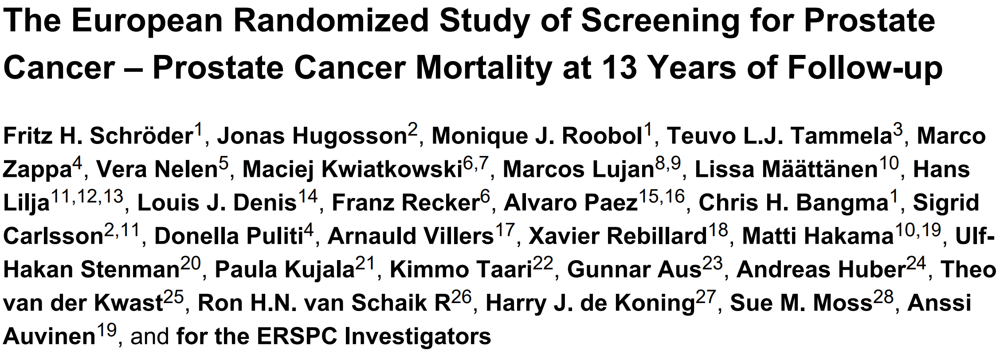

```{r packages,echo=FALSE,include=FALSE}
knitr::read_chunk("010-packages.R")
library(casebase)
library(survival)
library(splines)
library(tidyverse)
library(magrittr)
library(timereg)
set.seed(100)
```
---

```{r setup, include=FALSE}
knitr::opts_chunk$set(echo = FALSE)
knitr::opts_chunk$set(dev = 'pdf')
```

## Motivating example {.emphasized}
* Meet Justin.
    * Age: 56
    * Worried about his prostate.
    * What is Justin's two year risk of death due to prostate cancer?

## Popular methods in time-to-event analysis 

* In disease etiology, we tend to make use of the proportional hazards hypothesis .
    * Cox Regression

* When we want the absolute risk:
    * Parametric models
    * Breslow estimator

## Motivations for a new method
* Julien and Hanley found that survival analysis rarely produces prognostic functions, even though the software is widely available in cox regression packages. [1]
* They believe the stepwise nature is the reason, as it reduces interpretability. [1]
* Want to easily model non-proportional hazards. [1]
* A streamlined approach for reaching a **smooth absolute risk** curve. [1]


## Dr. Cox's perspective


## European Randomized Study of Prostate Cancer Screening (ERSPC) Data

* ~150 000 men ages 55-69.
* Examined effects screening has on death due to prostate cancer.




## ERSPC Data
```{r echo=TRUE,eval=FALSE}
head(casebase::ERSPC)
```

```{r , echo=FALSE, warning=FALSE,message=FALSE}
PatientID=c(1,2,3,4,5)
repSample<-c(3,1682,40176,146154,159814)
repSample<-casebase::ERSPC[repSample,]
repSample=cbind(PatientID,repSample)
repSample$Follow.Up.Time=round(repSample$Follow.Up.Time,3)
knitr::kable(repSample,row.names = FALSE)

ERSPC$ScrArm <- factor(ERSPC$ScrArm, 
                       levels = c(0,1), 
                       labels = c("Control group", "Screening group"))
```

## Recall
* **Using the ERSPC dataset and casebase, we will determine Justin's absolute risk for death by prostate cancer.**

## Casebase Overview

1. Clever sampling.
2. Implicitly deals with censoring.
3. Allows a parametric fit using *logistic regression*.

* Casebase is parametric, and allows different parametric fits by incorporation of the time component.
* Package contains an implementation for generating *population-time* plots.

## Casebase: Sampling
```{r , echo=FALSE, warning=FALSE,message=FALSE}
ERSPC=casebase::ERSPC
nobs <- nrow(ERSPC)
ftime <- ERSPC$Follow.Up.Time
ord <- order(ftime, decreasing = FALSE)
yCoords <- cbind(cumsum(ERSPC[ord, "DeadOfPrCa"] == 1),
cumsum(ERSPC[ord, "DeadOfPrCa"] == 0))
yCoords <- cbind(yCoords, nobs - rowSums(yCoords))
aspectRatio <- 0.75
height <- 8.5 * aspectRatio; width <- 11 * aspectRatio
cases <- ERSPC[, "DeadOfPrCa"] == 1
comps <- ERSPC[, "DeadOfPrCa"] == 2

# randomly move the cases vertically
moved_cases <- yCoords[cases[ord], 3] * runif(sum(cases))
moved_comps <- yCoords[comps[ord], 3] * runif(sum(comps))
plot(0, type = 'n', xlim = c(0, max(ftime)), ylim = c(0, nobs),
xlab = 'Follow-up time (years)', ylab = 'Population')

```

## Casebase: Sampling
```{r , echo=FALSE, warning=FALSE,message=FALSE}
plot(0, type = 'n', xlim = c(0, max(ftime)), ylim = c(0, nobs),
xlab = 'Follow-up time (years)', ylab = 'Population')
polygon(c(0, 0, ftime[ord], max(ftime), 0),
c(0, nobs, yCoords[,3], 0, 0),
col = "grey80")
```

## Casebase: Sampling
```{r , echo=FALSE, warning=FALSE,message=FALSE}
plot(0, type = 'n', xlim = c(0, max(ftime)), ylim = c(0, nobs), legend=TRUE,
xlab = 'Follow-up time (years)', ylab = 'Population')
polygon(c(0, 0, ftime[ord], max(ftime), 0),
c(0, nobs, yCoords[,3], 0, 0),
col = "grey80")
points((ftime[ord])[cases[ord]], yCoords[cases[ord],3], pch = 19,
col = "firebrick3", cex = 0.5)
legend("right", legend = c("Event"),
col = c("firebrick3", "dodgerblue2", "black"),
pch = 19)

```

## Casebase: Sampling
```{r,echo=TRUE,eval=FALSE}
casebase::popTime(Data,Event,Time)
```
```{r , echo=FALSE, warning=FALSE,message=FALSE}

plot(0, type = 'n', xlim = c(0, max(ftime)), ylim = c(0, nobs),
xlab = 'Follow-up time (years)', ylab = 'Population')
polygon(c(0, 0, ftime[ord], max(ftime), 0),
c(0, nobs, yCoords[,3], 0, 0),
col = "grey80")
points((ftime[ord])[cases[ord]], moved_cases, pch = 19,
col = "firebrick3", cex = 0.5)
legend("topright", legend = c("Relapse"),
col = c("firebrick3", "dodgerblue2", "black"),
pch = 19)
death="DeadOfPrCa"
ftime="Follow.Up.Time"
```


## Casebase: Sampling
```{r,echo=FALSE}
ftime <- ERSPC$Follow.Up.Time
plot(0, type = 'n', xlim = c(0, max(ftime)), ylim = c(0, nobs),
xlab = 'Follow-up time (years)', ylab = 'Population')
points((ftime[ord])[cases[ord]], yCoords[cases[ord],3], pch = 19,
col = "white", cex = 0.5)
lines(rep((ftime[ord])[cases[ord]], each=3), t(matrix(c(yCoords[cases[ord],3], rep(c(0,NA),each=length(yCoords[cases[ord],3]))), ncol=3)),col="grey80") 
points((ftime[ord])[cases[ord]], moved_cases, pch = 19,
col = "firebrick3", cex = 0.5)
legend("topright", legend = c("Relapse"),
col = c("firebrick3", "dodgerblue2", "black"),
pch = 19)
ERSPC$ScrArm<-factor(ERSPC$ScrArm)
ERSPC$DeadOfPrCa<-as.numeric(ERSPC$DeadOfPrCa)
```

## Casebase: Parametric families
* We can now fit models of the form:
$$\ log(h(t;\alpha,\beta))=g(t;\alpha)+\beta X$$
* By changing the function $g(t;\alpha)$, we can model different parametric families easily:


## Casebase: Parametric models
*Exponential*: $g(t;\alpha)$ is equal to a constant
```{r,echo=TRUE,eval=FALSE}
casebase::fitSmoothHazard(status ~ X1 + X2)
```
*Gompertz*: $g(t;\alpha)=\alpha t$
```{r,echo=TRUE,eval=FALSE}
casebase::fitSmoothHazard(status ~ time + X1 + X2)
```
*Weibull*: $g(t;\alpha) = \alpha log(t)$
```{r,echo=TRUE,eval=FALSE}
casebase::fitSmoothHazard(status ~ log(time) + X1 + X2)
```


## Death by prostate cancer: hazard ratios
```{r,echo=FALSE, warning=FALSE,message=FALSE}
wModel<-casebase::fitSmoothHazard(DeadOfPrCa ~
log(Follow.Up.Time) + 
ScrArm, data=casebase::ERSPC, ratio = 100)
```
```{r,echo=TRUE, warning=FALSE,message=FALSE,eval=FALSE}
casebase::fitSmoothHazard(DeadOfPrCa~ log(Follow.Up.Time)+ 
                          ScrArm, data=ERSPC, ratio = 100)
```

```{r echo=FALSE, warning=FALSE,message=FALSE, fig.height = 1, fig.width = 1, fig.align = "center",size='tiny',eval=FALSE}
#summary(wModel)
```

{width=88%}

## ERSPC Hazard comparison
```{r echo=FALSE, warning=FALSE,message=FALSE}
round_df <- function(x, digits) {
    # round all numeric variables
    # x: data frame 
    # digits: number of digits to round
    numeric_columns <- sapply(x, mode) == 'numeric'
    x[numeric_columns] <-  round(x[numeric_columns], digits)
    x
}
ERSPC$ScrArm<-factor(ERSPC$ScrArm)
gModel <- casebase::fitSmoothHazard(DeadOfPrCa ~ Follow.Up.Time + ScrArm, data=ERSPC, ratio = 100)
eModel <- casebase::fitSmoothHazard(DeadOfPrCa ~ ScrArm, data=ERSPC, ratio = 100)
wModel <- casebase::fitSmoothHazard(DeadOfPrCa ~ log(Follow.Up.Time)
+ ScrArm, data=ERSPC, ratio = 100)
sModel <- casebase::fitSmoothHazard(DeadOfPrCa ~ bs(Follow.Up.Time) + ScrArm, data=ERSPC, ratio = 100)
coxModel<-coxph(Surv(Follow.Up.Time,DeadOfPrCa ) ~ ScrArm, data=ERSPC)
compareHazard1=as.data.frame(cbind(coxModel$coefficients, gModel$coefficients[3] ,eModel$coefficients[2],wModel$coefficients[3]))

compareHazard1=as.data.frame(rbind(coxModel$coefficients, gModel$coefficients[3] ,eModel$coefficients[2], wModel$coefficients[3]))
compareHazard2=as.data.frame(rbind(summary(coxModel)$coefficients[3], summary(gModel)$coefficients[3,2],summary(eModel)$coefficients[2,2], summary(wModel)$coefficients[3,2] ))
compareHazard1=round_df(exp(compareHazard1),3)
compareHazard2=round_df(exp(compareHazard2),3)
names=c("Cox","Gompertz","Exponential","Weibull")
compareHazard=cbind(names,compareHazard1,compareHazard2)
colnames(compareHazard)=c('Model',"Hazard Ratio","Std.Error")


knitr::kable(compareHazard,row.names = FALSE)
```


## Absolute Risk
* We have a bunch of different parametric hazard models now.
* To get the absolute risk, we need to evaluate the following equation in relation to the hazard:
$$CI(x,t)=1-e^{-\int^{t}_{0}h(x,u)du}$$
* *CI(x,t)*= Cumulative Incidence (Absolute Risk)
* *h(x,u)*= Hazard function

* Lets use the weibull hazard


## Casebase: Absolute Risk comparison
```{r eval=FALSE,echo=TRUE}
casebase::absoluteRisk(fit, time=5, covariate_profile)
```
```{r echo=FALSE,warning=FALSE,message=FALSE}
time_points <- seq(0,15, 1)
newData=as.data.frame(cbind(factor(0),2,0))
colnames(newData)=c("ScrArm","Follow.Up.Time","DeadOfPrCa")
newData$ScrArm=factor(newData$ScrArm)
# calculate cumulative incidence using casebase model
wRisk <- absoluteRisk(object = wModel,time = time_points,newdata = newData)
#plot(wRisk)
coxRisk=survfit(coxModel, newdata = newData)
#plot(coxRisk$time,coxRisk$cumhaz)


# cumulative incidence function for the Cox model
plot(coxRisk$time,coxRisk$cumhaz, type="l",lwd=3,
xlab = "Years", ylab = "Cumulative Incidence (%)", fun = "event",
xlim = c(0,15), conf.int = F, col = "red", 
main = sprintf("Estimated Cumulative Incidence (risk) With No Screening"))

# add casebase curve with legend
lines(wRisk[,1], wRisk[,2], type = "l", col = "blue",lwd=3)
legend("bottomright", 
legend = c("semi-parametric (Cox)", "parametric (casebase)"), 
col = c("red","blue"),
lty = c(1, 1), 
bg = "gray90")

```

## Summary

* Casebase sampling implicitly incorporates censoring and permits the use of GLMs and the tools associated with them
* The casebase package contains tools to generate:
    * Population-Time plots
    * Hazard functions
    * Absolute Risk
    * Casebase can deal with competing risks.


## References 1

1.Hanley, James A, and Olli S Miettinen. 2009. "Fitting Smooth-in-Time Prognostic Risk Functions via Logistic Regression." *The International Journal of Biostatistics 5 (1)*.

2.Olli presentation slides?

3.Saarela, Olli. 2015. "A Case-Base Sampling Method for Estimating Recurrent Event Intensities." *Lifetime Data Analysis*. Springer, 1–17

## References 2

4.Schroder FH, et al., for the ERSPC Investigators.Screening and Prostate-Cancer Mortality in a Randomized European Study. *N Engl J Med* 2009;360:1320-8.

5.Scrucca L, Santucci A, Aversa F. Competing risk analysis using R: an easy guide for clinicians. *Bone Marrow Transplant*. 2007 Aug;40(4):381-7. doi: 10.1038/sj.bmt.1705727.

6.Turgeon, M. (2017, June 10). Retrieved May 05, 2019, from https://www.maxturgeon.ca/slides/MTurgeon-2017-Student-Conference.pdf

## Tutorial and Slides
\begin{center}
Tutorial:

http://sahirbhatnagar.com/casebase/

Slides:

https://github.com/Jesse-Islam/UseR--CaseBase-Presentation


Questions?
\end{center}

## APPENDIX

## Competing Risks
* Current methods:
    * Fine-Gray
    * Kaplan-Meier
* Proposed method:
    * Case-Base

## Competing Risks: Data
* Two diseases:
    * Acute Lymphoblastic leukemia (ALL)
    * Acute Myeloblastic leukemia (AML)
* Contains a competing event.

```{r eval=FALSE, echo=TRUE}
head(casebase::bmtcrr)
```
```{r,warning=FALSE,message=FALSE}
sample=head(casebase::bmtcrr,4)
sample=sample[,c("D","Status","ftime")]
knitr::kable(head(sample),row.names = FALSE)
```


```{r,echo=FALSE,warning=FALSE,message=FALSE}
newdata <- data.frame("Sex" = factor(c("F", "F"), 
levels = c("F", "M")),
"D" = c("ALL", "AML"),
"Phase" = factor(c("Relapse", "Relapse"), 
levels = c("CR1", "CR2", "CR3", "Relapse")),
"Age" = c(35, 35),
"Source" = factor(c("PB", "PB"), 
levels = c("BM+PB", "PB")))
fit_cb <- fitSmoothHazard(Status ~ ftime + Sex + D + Phase + Source + Age,
data = bmtcrr, time = "ftime")
fit_fg <- comp.risk(Event(ftime, Status) ~ const(Sex) + const(D) + 
const(Phase) + const(Source) + const(Age), 
data = bmtcrr, cause = 1, model = "fg")
time_points <- (0:100)*60/100
risk_cb <- absoluteRisk(object = fit_cb, time = time_points, method = "montecarlo", newdata = newdata)
risk_cb <- bind_rows(data.frame(Time = time_points, Method = "Case-base", Risk = risk_cb[,2], Disease = "ALL",
stringsAsFactors = FALSE),
data.frame(Time = time_points, Method = "Case-base", Risk = risk_cb[,3], Disease = "AML",
stringsAsFactors = FALSE))

risk_fg <- predict(fit_fg, newdata, times = time_points)
risk_fg <- bind_rows(data.frame(Time = time_points, Method = "Fine-Gray", Risk = risk_fg$P1[1,], Disease = "ALL",
stringsAsFactors = FALSE),
data.frame(Time = time_points, Method = "Fine-Gray", Risk = risk_fg$P1[2,], Disease = "AML",
stringsAsFactors = FALSE))
risk_km <- map_df(c("ALL", "AML"), function(disease) {
foo <- bmtcrr %>% 
filter(D == disease) %>% 
survfit(Surv(ftime,Status == 1) ~ 1, data = .)
data.frame(Time = foo$time, Method = "Kaplan-Meier", Risk = 1 - foo$surv, Disease = disease,
stringsAsFactors = FALSE) %>%
filter(Time <= 60)
})
disease_names <- c("ALL" = "Acute Lymphoid Leukemia",
"AML" = "Acute Myeloid Leukemia")
p <- risk_cb %>%
bind_rows(risk_fg,
risk_km) %>% 
arrange(Disease, Risk) %>% 
ggplot(aes(Time, Risk, colour = Method)) + 

geom_step(data = . %>% filter(Method != "Case-base"),size=2) + 
geom_line(data = . %>% filter(Method == "Case-base"),size=1.5) + 
facet_grid(Disease ~ ., labeller = as_labeller(disease_names)) + ylim(c(0,1)) + theme(legend.position = "top") +
xlab("Time (in Months)") + ylab("Relapse risk")
```
## Competing Risks: Absolute Risk
```{r echo=TRUE,eval=FALSE,warning=FALSE,message=FALSE}
fit_cb <- casebase::fitSmoothHazard(Status ~ ftime 
                                      + ... , data =
                                      bmtcrr)
risk_cb <- absoluteRisk(fit_cb, Time, Newdata)
```

## Competing Risks: Absolute Risk
```{r,warning=FALSE,message=FALSE}
p
```